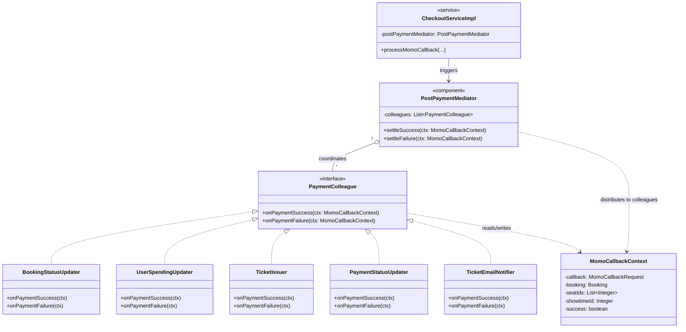

# UML — Mediator (Pattern Only)

> Tài liệu chi tiết: [`docs/patterns/02-mediator.md`](../../docs/patterns/02-mediator.md)

```mermaid
classDiagram
  direction TB

  class MomoCallbackContext {
    -callback: MomoCallbackRequest
    -booking: Booking
    -seatIds: List~Integer~
    -showtimeId: Integer
    -success: boolean
  }

  class PaymentColleague {
    <<interface>>
    +onPaymentSuccess(ctx: MomoCallbackContext)
    +onPaymentFailure(ctx: MomoCallbackContext)
  }

  class PostPaymentMediator {
    <<component>>
    -colleagues: List~PaymentColleague~
    +settleSuccess(ctx: MomoCallbackContext)
    +settleFailure(ctx: MomoCallbackContext)
  }

  class BookingStatusUpdater {
    +onPaymentSuccess(ctx)
    +onPaymentFailure(ctx)
  }

  class UserSpendingUpdater {
    +onPaymentSuccess(ctx)
    +onPaymentFailure(ctx)
  }

  class TicketIssuer {
    +onPaymentSuccess(ctx)
    +onPaymentFailure(ctx)
  }

  class PaymentStatusUpdater {
    +onPaymentSuccess(ctx)
    +onPaymentFailure(ctx)
  }

  class TicketEmailNotifier {
    +onPaymentSuccess(ctx)
    +onPaymentFailure(ctx)
  }

  class CheckoutServiceImpl {
    <<service>>
    -postPaymentMediator: PostPaymentMediator
    +processMomoCallback(...)
  }

  %% Pattern structure
  PaymentColleague <|.. BookingStatusUpdater
  PaymentColleague <|.. UserSpendingUpdater
  PaymentColleague <|.. TicketIssuer
  PaymentColleague <|.. PaymentStatusUpdater
  PaymentColleague <|.. TicketEmailNotifier
  PostPaymentMediator "1" o-- "*" PaymentColleague : coordinates
  PostPaymentMediator ..> MomoCallbackContext : distributes to colleagues
  PaymentColleague ..> MomoCallbackContext : reads/writes
  CheckoutServiceImpl --> PostPaymentMediator : triggers
```
