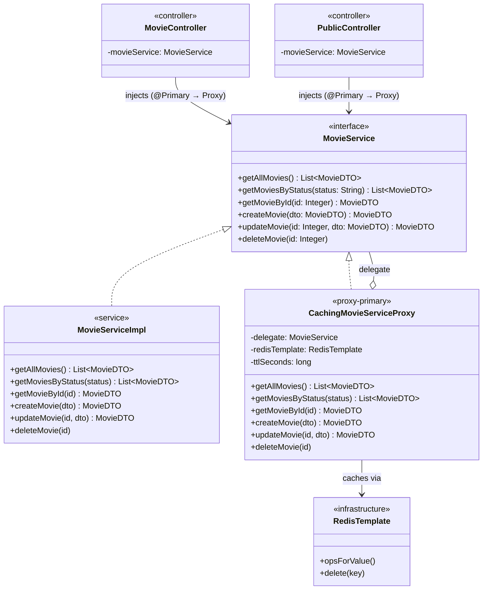

# UML — Proxy / Caching (Pattern Only)

> Tài liệu chi tiết: [`docs/patterns/03-proxy.md`](../../docs/patterns/03-proxy.md)

```mermaid
classDiagram
  direction TB

  class MovieService {
    <<interface>>
    +getAllMovies() List~MovieDTO~
    +getMoviesByStatus(status: String) List~MovieDTO~
    +getMovieById(id: Integer) MovieDTO
    +createMovie(dto: MovieDTO) MovieDTO
    +updateMovie(id: Integer, dto: MovieDTO) MovieDTO
    +deleteMovie(id: Integer)
  }

  class MovieServiceImpl {
    <<service>>
    +getAllMovies() List~MovieDTO~
    +getMoviesByStatus(status) List~MovieDTO~
    +getMovieById(id) MovieDTO
    +createMovie(dto) MovieDTO
    +updateMovie(id, dto) MovieDTO
    +deleteMovie(id)
  }

  class CachingMovieServiceProxy {
    <<proxy-primary>>
    -delegate: MovieService
    -redisTemplate: RedisTemplate
    -ttlSeconds: long
    +getAllMovies() List~MovieDTO~
    +getMoviesByStatus(status) List~MovieDTO~
    +getMovieById(id) MovieDTO
    +createMovie(dto) MovieDTO
    +updateMovie(id, dto) MovieDTO
    +deleteMovie(id)
  }

  class RedisTemplate {
    <<infrastructure>>
    +opsForValue()
    +delete(key)
  }

  class MovieController {
    <<controller>>
    -movieService: MovieService
  }

  class PublicController {
    <<controller>>
    -movieService: MovieService
  }

  %% Pattern structure
  MovieService <|.. MovieServiceImpl
  MovieService <|.. CachingMovieServiceProxy
  CachingMovieServiceProxy o-- MovieService : delegate
  CachingMovieServiceProxy --> RedisTemplate : caches via
  MovieController --> MovieService : injects (@Primary → Proxy)
  PublicController --> MovieService : injects (@Primary → Proxy)
```
