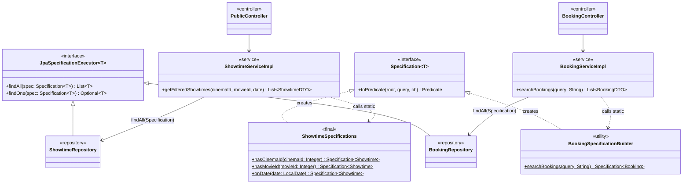

# UML — Specification (Pattern Only)

> Tài liệu chi tiết: [`docs/patterns/04-specification.md`](../../docs/patterns/04-specification.md)

```mermaid
classDiagram
  direction TB

  class Specification~T~ {
    <<interface>>
    +toPredicate(root, query, cb) Predicate
  }

  class ShowtimeSpecifications {
    <<final>>
    +hasCinemaId(cinemaId: Integer)$ Specification~Showtime~
    +hasMovieId(movieId: Integer)$ Specification~Showtime~
    +onDate(date: LocalDate)$ Specification~Showtime~
  }

  class BookingSpecificationBuilder {
    <<utility>>
    +searchBookings(query: String)$ Specification~Booking~
  }

  class JpaSpecificationExecutor~T~ {
    <<interface>>
    +findAll(spec: Specification~T~) List~T~
    +findOne(spec: Specification~T~) Optional~T~
  }

  class ShowtimeRepository {
    <<repository>>
  }

  class BookingRepository {
    <<repository>>
  }

  class ShowtimeServiceImpl {
    <<service>>
    +getFilteredShowtimes(cinemaId, movieId, date) List~ShowtimeDTO~
  }

  class BookingServiceImpl {
    <<service>>
    +searchBookings(query: String) List~BookingDTO~
  }

  class PublicController {
    <<controller>>
  }

  class BookingController {
    <<controller>>
  }

  %% Pattern structure
  Specification <|.. ShowtimeSpecifications : creates
  Specification <|.. BookingSpecificationBuilder : creates
  JpaSpecificationExecutor <|-- ShowtimeRepository
  JpaSpecificationExecutor <|-- BookingRepository
  ShowtimeServiceImpl --> ShowtimeRepository : findAll(Specification)
  ShowtimeServiceImpl ..> ShowtimeSpecifications : calls static
  BookingServiceImpl --> BookingRepository : findAll(Specification)
  BookingServiceImpl ..> BookingSpecificationBuilder : calls static
  PublicController --> ShowtimeServiceImpl
  BookingController --> BookingServiceImpl
```
