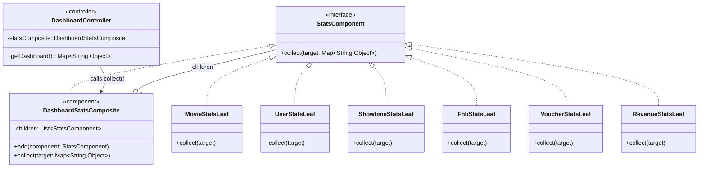

# UML — Composite (Pattern Only)

> Tài liệu chi tiết: [`docs/patterns/05-composite.md`](../../docs/patterns/05-composite.md)

```mermaid
classDiagram
  direction TB

  class StatsComponent {
    <<interface>>
    +collect(target: Map~String,Object~)
  }

  class DashboardStatsComposite {
    <<component>>
    -children: List~StatsComponent~
    +add(component: StatsComponent)
    +collect(target: Map~String,Object~)
  }

  class MovieStatsLeaf {
    +collect(target)
  }

  class UserStatsLeaf {
    +collect(target)
  }

  class ShowtimeStatsLeaf {
    +collect(target)
  }

  class FnbStatsLeaf {
    +collect(target)
  }

  class VoucherStatsLeaf {
    +collect(target)
  }

  class RevenueStatsLeaf {
    +collect(target)
  }

  class DashboardController {
    <<controller>>
    -statsComposite: DashboardStatsComposite
    +getDashboard() Map~String,Object~
  }

  %% Pattern structure
  StatsComponent <|.. DashboardStatsComposite
  StatsComponent <|.. MovieStatsLeaf
  StatsComponent <|.. UserStatsLeaf
  StatsComponent <|.. ShowtimeStatsLeaf
  StatsComponent <|.. FnbStatsLeaf
  StatsComponent <|.. VoucherStatsLeaf
  StatsComponent <|.. RevenueStatsLeaf
  DashboardStatsComposite "1" o-- "*" StatsComponent : children
  DashboardController --> DashboardStatsComposite : calls collect()
```
