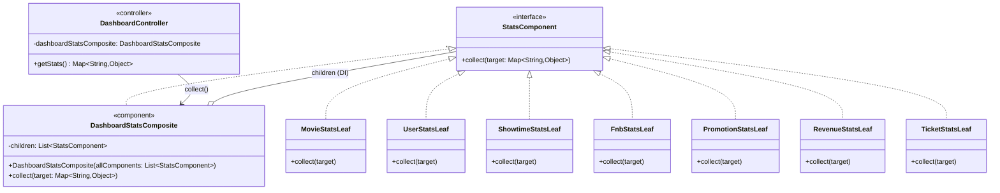

# UML — Composite (Pattern Only)

> Tài liệu chi tiết: [`docs/patterns/05-composite.md`](../../docs/patterns/05-composite.md)

**Ghi chú kỹ thuật:** `DashboardStatsComposite` nhận `List<StatsComponent>` qua constructor (Spring DI). Các leaf là bean `@Component`; composite lọc bỏ chính nó để tránh đệ quy. **Không** có phương thức `add()` — cấu trúc cây do container dựng.

