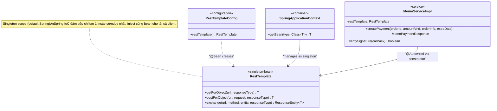

# UML — Singleton via Spring IoC (Pattern Only)

> Tài liệu chi tiết: [`docs/patterns/06-singleton.md`](../../docs/patterns/06-singleton.md)

> **Lưu ý:** `SecurityConfig` không sử dụng `RestTemplate` — class này chỉ cấu hình phân quyền HTTP/JWT, không liên quan đến pattern Singleton này.
