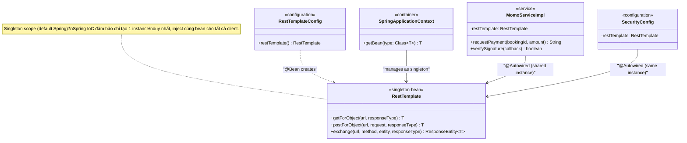

# UML — Singleton via Spring IoC (Pattern Only)

> Tài liệu chi tiết: [`docs/patterns/06-singleton.md`](../../docs/patterns/06-singleton.md)

```mermaid
classDiagram
  direction TB

  class RestTemplateConfig {
    <<configuration>>
    +restTemplate() RestTemplate
  }

  class RestTemplate {
    <<singleton-bean>>
    +getForObject(url, responseType) T
    +postForObject(url, request, responseType) T
    +exchange(url, method, entity, responseType) ResponseEntity~T~
  }

  class SpringApplicationContext {
    <<container>>
    +getBean(type: Class~T~) T
  }

  class MomoServiceImpl {
    <<service>>
    -restTemplate: RestTemplate
    +requestPayment(bookingId, amount) String
    +verifySignature(callback) boolean
  }

  class SecurityConfig {
    <<configuration>>
    -restTemplate: RestTemplate
  }

  %% Pattern structure — Singleton via Spring IoC
  RestTemplateConfig ..> RestTemplate : "@Bean creates"
  SpringApplicationContext --> RestTemplate : "manages as singleton"
  MomoServiceImpl --> RestTemplate : "@Autowired (shared instance)"
  SecurityConfig --> RestTemplate : "@Autowired (same instance)"

  note for RestTemplate "Singleton scope (default Spring):\nSpring IoC đảm bảo chỉ tạo 1 instance\nduy nhất, inject cùng bean cho tất cả client."
```
