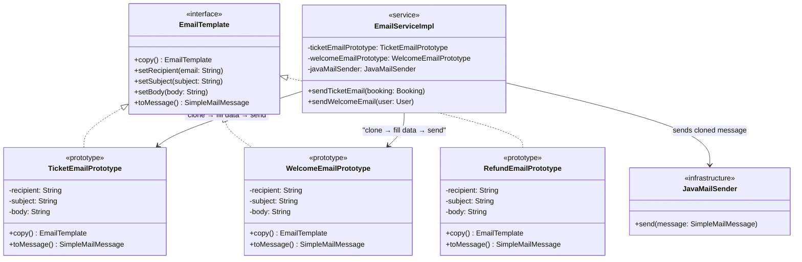

# UML — Prototype (Pattern Only)

> Tài liệu chi tiết: [`docs/patterns/07-prototype.md`](../../docs/patterns/07-prototype.md)

```mermaid
classDiagram
  direction TB

  class EmailTemplate {
    <<interface>>
    +copy() EmailTemplate
    +setRecipient(email: String)
    +setSubject(subject: String)
    +setBody(body: String)
    +toMessage() SimpleMailMessage
  }

  class TicketEmailPrototype {
    <<prototype>>
    -recipient: String
    -subject: String
    -body: String
    +copy() EmailTemplate
    +toMessage() SimpleMailMessage
  }

  class WelcomeEmailPrototype {
    <<prototype>>
    -recipient: String
    -subject: String
    -body: String
    +copy() EmailTemplate
    +toMessage() SimpleMailMessage
  }

  class RefundEmailPrototype {
    <<prototype>>
    -recipient: String
    -subject: String
    -body: String
    +copy() EmailTemplate
    +toMessage() SimpleMailMessage
  }

  class EmailServiceImpl {
    <<service>>
    -ticketEmailPrototype: TicketEmailPrototype
    -welcomeEmailPrototype: WelcomeEmailPrototype
    -javaMailSender: JavaMailSender
    +sendTicketEmail(booking: Booking)
    +sendWelcomeEmail(user: User)
  }

  class JavaMailSender {
    <<infrastructure>>
    +send(message: SimpleMailMessage)
  }

  %% Pattern structure
  EmailTemplate <|.. TicketEmailPrototype
  EmailTemplate <|.. WelcomeEmailPrototype
  EmailTemplate <|.. RefundEmailPrototype
  EmailServiceImpl --> TicketEmailPrototype : "clone → fill data → send"
  EmailServiceImpl --> WelcomeEmailPrototype : "clone → fill data → send"
  EmailServiceImpl --> JavaMailSender : sends cloned message
```
