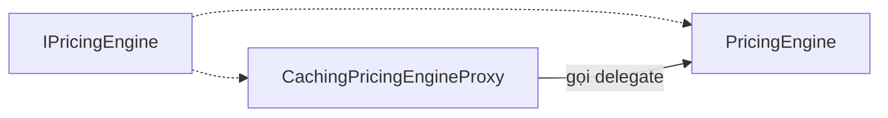

# Giải thích class — Dynamic Pricing Engine (bản mở rộng, chi tiết)

Tài liệu đi kèm [`08-dynamic-pricing-engine.md`](./08-dynamic-pricing-engine.md).

**Nếu bạn thấy dài hoặc khó:** đừng đọc từ đầu đến cuối. Hãy làm **2 bước**: (1) đọc [Bản tra nhanh — mỗi class một dòng](#bản-tra-nhanh--mỗi-class-một-dòng) để biết “class đó là cái gì”; (2) chỉ kéo xuống **đúng mục số** (1, 2, 3…) khi cần xem từng field/method.

Mục tiêu: hình dung **ai làm gì** trong rạp chiếu phim / app đặt vé — ít dùng từ pattern, nhiều dùng **câu đời thường**.

---

## Mục lục

1. [Hiểu nhanh + bản đồ package](#hiểu-nhanh-tiền-chạy-qua-đâu)
1b. [**Bản tra nhanh — mỗi class một dòng**](#bản-tra-nhanh--mỗi-class-một-dòng) ← **nên đọc trước**
2. [Nếu bạn thấy quá tải — đọc theo lộ trình](#nếu-bạn-thấy-quá-tải--đọc-theo-lộ-trình)
3. [Thuật ngữ](#thuật-ngữ)
4. [Ví dụ minh họa có số (kịch bản từng bước)](#ví-dụ-minh-họa-có-số-kịch-bản-từng-bước)
5. [Ba loại Context — tránh nhầm](#ba-loại-context--tránh-nhầm)
6. [1. DTO](#1-dto--dữ-liệu-vào-và-ra) … [9. Hạn chế](#9-dễ-hiểu-nhầm--hạn-chế) — kéo xuống trong file theo heading.
7. [Luồng chi tiết (đối thoại các bước)](#luồng-chi-tiết--đối-thoại-giữa-các-thành-phần)
8. [10. Hỏi–đáp thường gặp](#10-hỏi--đáp-thường-gặp)

---

## Hiểu nhanh: tiền chạy qua đâu?

1. Khách gửi **phiếu yêu cầu** → `BookingCalculationDTO`.
2. Hệ thống **kiểm tra từng bước** (chuỗi handler) → suất ổn, ghế còn, mã giảm (nếu có) ổn.
3. Một class **gom đủ thông tin** từ DB → `PricingContext` (nhờ `PricingContextBuilder`).
4. **Máy tính tiền** nhận `PricingContext` → có thể **đọc cache Redis** trước (`CachingPricingEngineProxy`), không có thì **tính thật** (`PricingEngine`).
5. Kết quả trả về **bảng kê** → `PriceBreakdownDTO`.

**Một câu để nhớ:** *Validate (chuỗi) → Build (gom DB) → Calculate (strategy + giảm giá), có thể nhảy cóc nhờ Redis.*

---

### Bản đồ package

| Bạn cần… | Package |
|----------|---------|
| DTO vào/ra | `com.cinema.booking.dtos` |
| Chuỗi validate | `...strategy_decorator.pricing.validation` |
| Engine, cache, strategy, giảm giá | `...strategy_decorator.pricing` |
| Điều kiện cuối tuần/lễ… | `com.cinema.booking.patterns.specification` |
| Entity JPA | `com.cinema.booking.entities` |
| Gọi full luồng tính giá | `...services.impl.BookingServiceImpl` |
| Kiểm tra còn lượt mã | `...services.PromotionInventoryService` |

---

## Nếu bạn thấy quá tải — đọc theo lộ trình

| Lần đọc | Chỉ cần đọc các mục |
|---------|----------------------|
| **Lần 1 (15 phút)** | [Hiểu nhanh](#hiểu-nhanh-tiền-chạy-qua-đâu) → [Thuật ngữ](#thuật-ngữ) → [Ví dụ có số](#ví-dụ-minh-họa-có-số-kịch-bản-từng-bước) → [Ba Context](#ba-loại-context--tránh-nhầm) |
| **Lần 2** | Mục **1 (DTO)** + **1b (Entity)** + **8 (Engine + BookingService)** |
| **Lần 3** | Mục **2 (Chuỗi validate)** + **5 (Builder)** |
| **Lần 4** | Mục **3 (Proxy)** + **6 (Strategy)** + **7 (Decorator)** |
| **Lần 5** | Mục **4 (Specification)** + [Hỏi–đáp](#10-hỏi--đáp-thường-gặp) |

---

## Thuật ngữ

| Thuật ngữ | Giải thích ngắn |
|-----------|----------------|
| **DTO** | Object chỉ chở dữ liệu (request/response), không chứa “công thức” phức tạp. |
| **Entity / JPA** | Class ánh xạ **bảng trong database** (Showtime, Seat, …). |
| **Handler (CoR)** | Một **bước kiểm tra** trong chuỗi; xong thì nhường bước sau. |
| **Context** | “Túi” chứa mọi thứ cần cho bước tiếp theo — có nhiều loại túi khác nhau (xem [bảng so sánh](#ba-loại-context--tránh-nhầm)). |
| **Strategy** | Một **cách tính** cho một loại tiền (vé / F&B / phụ thu); thay đổi rule ít đụng chỗ khác. |
| **Decorator (chuỗi giảm giá)** | Nhiều lớp **bọc nhau**; mỗi lớp **trừ thêm** một phần, gọi lớp trong trước. |
| **Proxy (cache)** | Cùng interface với engine thật; **chặn** lời gọi để đọc/ghi Redis trước. |
| **Specification** | Các hàm trả lời **đúng/sai** (cuối tuần? lễ? …) từ một gói dữ liệu cố định. |
| **Subtotal (trong engine)** | Tổng **trước khi** áp chuỗi giảm giá = vé + F&B + phụ thu thời điểm. |
| **Redis / TTL** | Bộ nhớ ngoài để **nhớ kết quả** đã tính; TTL = sau bao lâu thì xóa/ coi hết hạn. |
| **Bean Spring** | Object do framework **tạo và inject**; tên bean như `pricingEngine`, `cachingPricingEngineProxy`. |

---

## Ví dụ minh họa có số (kịch bản từng bước)

*Đơn vị dưới đây là “đơn vị tiền” giả định (có thể coi là nghìn đồng); chỉ để hiểu **thứ tự cộng trừ**, không ràng buộc đúng từng config trong máy bạn.*

### Giả định kịch bản

- Một suất chiếu: `basePrice = 100` **mỗi vé** (một ghế).
- Một ghế **thường**, không phụ thu loại ghế (`priceSurcharge = 0`).
- F&B: một món đơn giá `50`, số lượng `1` → tiền F&B = `50`.
- Suất rơi **cuối tuần**, cấu hình phụ thu **15%** trên **tổng tiền vé** → \(100 \times 15\% = 15\).
- Mã giảm: **10% trên subtotal** (subtotal = vé + F&B + phụ thu = \(100 + 50 + 15 = 165\)) → giảm \(16{,}5\) (làm tròn theo code là 2 chữ số).
- Thành viên: **5%** trên **phần còn lại sau khi đã trừ mã** (xấp xỉ \(148{,}5 \times 5\%\)).

### Bước A — Khách gửi gì? (`BookingCalculationDTO`)

Ví dụ logic: `showtimeId = 42`, `seatIds = [7]`, `fnbs = [{ itemId: 101, quantity: 1 }]`, `promoCode = "SUMMER10"` (giả sử mã là loại 10%).

### Bước B — Chuỗi validate làm gì? (tóm tắt hành vi)

1. **ShowtimeFutureHandler:** Suất 42 có tồn tại không? Giờ chiếu đã qua chưa? → Nếu ổn, **load** `Showtime` vào `PricingValidationContext`.
2. **SeatsAvailableHandler:** Có ít nhất một ghế? Ghế 7 **chưa** có vé cho suất 42?
3. **PromoValidHandler:** Nếu có mã: mã có trong DB, chưa hết hạn, **còn lượt** trong kho? → `setPromotion`.

Nếu bất kỳ bước nào “cấm”, request **dừng** và báo lỗi — **chưa** tính tiền.

### Bước C — `BookingServiceImpl` sau validate

Trong code, nếu `promoCode` không rỗng, service gọi lại `resolvePromotionForPricing` và **ghi đè** `validationCtx.promotion` (đồng bộ cách nhìn tồn kho với tầng service).

### Bước D — `PricingContextBuilder.build`

- Lấy **danh sách ghế** entity theo id.
- Với F&B: đọc bảng giá món → tạo `ResolvedFnbItem(101, "Tên món", 50, 1)`.
- Đếm **vé đã bán** / **tổng ghế phòng** (để sau này dùng rule occupancy — hiện phụ phí time-based chưa dùng).
- Lấy `Customer` nếu user đăng nhập (để giảm hạng).

### Bước E — `CachingPricingEngineProxy` (giả sử **cache trượt**)

Proxy gọi `PricingEngine.calculateTotalPrice`.

### Bước F — Ba strategy (trong `PricingEngine`)

1. **Ticket:** \(100\) (một ghế × `basePrice` + phụ thu loại ghế; ở đây phụ thu = 0).
2. **FNB:** \(50\) (`50 × 1`).
3. **Time-based:** \(15\) — vì cuối tuần **15%** nhưng **chỉ** áp trên **tổng vé** \(100\), không áp trên F&B.

**Subtotal (trước giảm giá)** = \(100 + 50 + 15 = 165\).

### Bước G — Chuỗi giảm giá (Decorator)

1. **NoDiscount:** bắt đầu với 0 đồng đã trừ.
2. **PromotionDiscountDecorator (nếu có promotion):** tính thêm phần trừ theo mã (ví dụ 10% của subtotal, không vượt quá phần còn lại).
3. **MemberDiscountDecorator (nếu có hạng):** tính % trên **số tiền còn lại sau bước mã**.

Engine gom `totalDiscount`, tách `promotionDiscount` và `membershipDiscount` vào `DiscountResult`, rồi đổ sang `PriceBreakdownDTO`.

### Bước H — Kết quả trả về (`PriceBreakdownDTO`)

Bạn sẽ thấy các field như `ticketTotal`, `fnbTotal`, `timeBasedSurcharge`, `discountAmount`, `membershipDiscount`, `finalTotal`, `appliedStrategy` — **đúng thứ tự nghiệp vụ** ở trên.

**Điểm quan trọng:** `timeBasedSurcharge` **không** nhân trên F&B trong code hiện tại; ví dụ số phản ánh đúng điều đó.

---

## Ba loại Context — tránh nhầm

Hệ thống có **ba “túi”** tên gần giống nhau. Nhầm túi là nhầm **giai đoạn** trong luồng.

| Tên | Giai đoạn | Nội dung chính | Ai tạo / ai dùng |
|-----|-----------|----------------|------------------|
| **`PricingValidationContext`** | **Trước** khi tính tiền | `request` + dần có `showtime`, `promotion` sau validate | `BookingServiceImpl` tạo; **chuỗi handler** bổ sung; `PricingContextBuilder` **đọc** |
| **`PricingContext`** | **Lúc** tính tiền | Đủ ghế entity, F&B đã có giá, khách, số đếm phòng, `bookingTime`… | `PricingContextBuilder` **tạo**; **mọi strategy + decorator + proxy/engine** dùng |
| **`PricingSpecificationContext`** | **Chỉ** để hỏi đúng/sai (cuối tuần, lễ, …) | Snapshot: showtime, seats, customer, promotion, fnbTotal, occupancy, bookingTime | `TimeBasedPricingStrategy` **tạo** từ `PricingContext` để gọi `PricingConditions` |

**Câu ghi nhớ:**

- Đang **kiểm tra hợp lệ** → nghĩ `PricingValidationContext`.
- Đang **cộng trừ tiền** → nghĩ `PricingContext`.
- Đang hỏi **“có phải cuối tuần không?”** trong code specification → nghĩ `PricingSpecificationContext`.

---

## Bản tra nhanh — mỗi class một dòng

Đọc bảng này như **danh bạ**: cột giữa = **một câu**; cột phải = **ví dụ trong rạp / app**.

| Class | Chỉ cần nhớ một câu | Ví dụ như |
|-------|---------------------|-----------|
| `BookingCalculationDTO` | Tờ giấy khách gửi lên: suất, ghế, món, mã. | “Tôi chọn suất 8h, ghế J12, 1 bắp, mã GIAM10.” |
| `PriceBreakdownDTO` | Tờ hệ thống trả về: tách từng khoản + tổng. | “Vé 200k, bắp 50k, phụ thu 30k, giảm 20k, trả 260k.” |
| `Showtime` | Một suất chiếu trong máy chủ (giờ, giá nền, phòng). | “Suất tối thứ 7, phòng 3, giá nền 100k.” |
| `Seat` | Một ghế cụ thể + loại ghế. | “Ghế J12, loại VIP.” |
| `SeatType` | Quy tắc “ghế VIP đắt hơn bao nhiêu”. | “VIP +20k mỗi ghế.” |
| `Promotion` | Một mã giảm trong DB (% hoặc số tiền, hạn dùng). | “Mã TET giảm 15%, hết hạn 31/1.” |
| `Customer` | Tài khoản đang đăng nhập + hạng. | “An A đăng nhập, hạng Vàng.” |
| `MembershipTier` | Bảng quy định hạng Vàng giảm mấy %. | “Vàng giảm 5%.” |
| `PricingValidationHandler` | Quy ước: mỗi bước kiểm tra phải có `validate` và nối bước sau. | “Hợp đồng cho nhân viên soát vé.” |
| `AbstractPricingValidationHandler` | Khung: làm xong việc mình thì gọi bước sau. | “Quy trình: bước 1 xong mới tới bước 2.” |
| `PricingValidationContext` | Túi đựng request + dần có suất/mã sau khi soát. | “Phiếu soát đang kẹp thêm bản in suất chiếu.” |
| `ShowtimeFutureHandler` | Bước 1: suất có thật và chưa chiếu không? | “Suất này còn bán được không?” |
| `SeatsAvailableHandler` | Bước 2: có chọn ghế và ghế còn trống không? | “Ghế này chưa ai mua.” |
| `PromoValidHandler` | Bước 3 (nếu có mã): mã đúng, còn hạn, còn lượt không? | “Mã còn dùng được không?” |
| `PromotionInventoryService` | Chỗ hỏi “kho mã còn bao nhiêu lượt” (xem giá vs trừ lượt). | “Chỉ xem: còn 100 lượt; thanh toán mới trừ.” |
| `PricingValidationConfig` | File nối 3 bước thành một chuỗi bean. | “Sơ đồ: A → B → C.” |
| `IPricingEngine` | Hợp đồng: đưa `PricingContext` → trả bảng giá. | “Mọi máy tính giá đều có nút ‘Tính’ giống nhau.” |
| `PricingEngine` | Máy tính **thật**: cộng vé, F&B, phụ thu, trừ giảm. | “Máy POS tính đủ công thức.” |
| `CachingPricingEngineProxy` | Lớp ngoài: hỏi tủ nhớ Redis trước, không có mới nhờ máy thật. | “Nhân viên nhớ khách vừa hỏi giá y hệt.” |
| `PricingSpecificationContext` | Gói dữ liệu chỉ để hỏi đúng/sai (cuối tuần, lễ…). | “Phiếu chỉ để trả lời câu hỏi, không để tính tiền.” |
| `PricingConditions` | Các câu hỏi: có phải cuối tuần? lễ? … | “Lịch: hôm nay có phải lễ không?” |
| `PricingContext` | Túi **đủ mọi thứ** để bấm nút tính tiền. | “Đủ thông tin để máy POS bấm =.” |
| `ResolvedFnbItem` | Một dòng món đã biết giá từ DB. | “Bắp 50k × 2.” |
| `PricingContextBuilder` | Người lắp túi đủ thông tin từ DB + request. | “Thu ngân gom đủ giấy tờ trước khi tính.” |
| `PricingLineType` | Ba nhãn: vé / F&B / phụ thu giờ. | “Ba ô trên máy tính.” |
| `PricingStrategy` | Mỗi ô (nhãn) có một cách tính riêng. | “Ô ‘vé’ chỉ tính vé.” |
| `TicketPricingStrategy` | Cộng tiền từng ghế. | “2 ghế = giá suất×2 + phụ thu ghế.” |
| `FnbPricingStrategy` | Cộng tiền từng món đã có giá. | “Bắp + nước.” |
| `TimeBasedPricingStrategy` | Nếu cuối tuần/lễ thì thêm % **trên tiền vé**. | “Cuối tuần: thêm % trên vé, không tính trên bắp.” |
| `DiscountComponent` | Hợp đồng: “cho tôi subtotal, tôi trả đã trừ bao nhiêu”. | “Bước trừ tiền trong máy.” |
| `BaseDiscountDecorator` | Khung bọc lớp bên trong. | “Vỏ ngoài của củ hành.” |
| `NoDiscount` | Lõi: chưa trừ gì. | “Chưa áp giảm.” |
| `PromotionDiscountDecorator` | Trừ thêm theo mã. | “Áp mã TET.” |
| `MemberDiscountDecorator` | Trừ thêm theo hạng (sau mã). | “Hạng Vàng trừ tiếp.” |
| `DiscountResult` | Ba số: tổng trừ, trừ mã, trừ hạng. | “Phiếu in: đã trừ từng loại.” |
| `BookingServiceImpl` | Cửa chính API: validate → build → gọi engine. | “Quầy: soát xong mới bấm tính tiền.” |

Sau khi đọc bảng trên, phần dưới chỉ là **mở rộng** từng dòng (field, method).

---

## 1. DTO — dữ liệu vào và ra

### `BookingCalculationDTO` — phiếu khách gửi lên

> **Một câu:** Chứa **những gì khách chọn** trên app khi bấm xem giá.  
> **Ví dụ như:** Giấy ghi “suất mấy, ghế mấy, món gì, mã gì”.  
> **Không phải:** Không phải kết quả tiền — tiền nằm ở `PriceBreakdownDTO`.

**Ai tạo?** App / API gửi JSON; server nhận vào class này.  
**Đi đâu tiếp?** Vào `BookingServiceImpl.calculatePrice` → nhét vào `PricingValidationContext.request` → `PricingContextBuilder` đọc lại `seatIds`, `fnbs`.

**Các ô trên phiếu (field)**

| Tên | Chỉ cần hiểu |
|-----|----------------|
| `showtimeId` | Suất chiếu số mấy. |
| `seatIds` | Danh sách id ghế đã chọn. |
| `fnbs` | Danh sách món + số lượng. |
| `promoCode` | Mã giảm (để trống = không dùng). |

#### `FnbOrderDTO` — một dòng trong giỏ đồ ăn

> **Một câu:** Một món + số lượng.

| Tên | Chỉ cần hiểu |
|-----|----------------|
| `itemId` | Món nào trong menu (id trong DB). |
| `quantity` | Mấy phần. |

---

### `PriceBreakdownDTO` — hóa đơn nháp trả về

> **Một câu:** **Kết quả** tiền từng phần + tổng phải trả.  
> **Ví dụ như:** Hóa đơn in ra cho khách xem trước khi trả tiền.  
> **Không phải:** Khách **không gửi** class này lên — server **tự tạo**.

**Ai tạo?** `PricingEngine` (có thể sau khi Redis “nhớ hộ” qua Proxy).

**Các dòng trên hóa đơn (field)**

| Tên | Chỉ cần hiểu |
|-----|----------------|
| `ticketTotal` | Tiền vé (đủ ghế). |
| `fnbTotal` | Tiền đồ ăn uống. |
| `timeBasedSurcharge` | Phụ thu vì **cuối tuần/lễ** — **chỉ** tính trên phần **vé**, không tính trên F&B. |
| `membershipDiscount` | Tiền giảm **riêng** do hạng thành viên (để hiện một dòng). |
| `discountAmount` | **Tổng** tiền đã giảm = mã + hạng. |
| `appliedStrategy` | Chữ mô tả “đã tính những gì” (vé, F&B, phụ thu, mã, hạng…). |
| `finalTotal` | Số **phải trả** cuối cùng (không âm). |

**Nhớ:** `discountAmount` bao gồm cả giảm mã và giảm hạng; `membershipDiscount` chỉ là **phần hạng** trong đó.

---

## 1b. Entity JPA — bản ghi trong database

*(Dữ liệu lưu bảng SQL; app đọc ra thành object Java.)*

### Cách đọc nhanh từng bảng

| Entity | Một câu | Field quan trọng (nhớ tên là đủ) |
|--------|---------|-----------------------------------|
| `Showtime` | Một suất chiếu: giờ, phòng, **giá nền** vé. | `showtimeId`, `startTime`, `basePrice`, `room` |
| `Seat` | Một ghế: id, **loại ghế**. | `seatId`, `seatType` |
| `SeatType` | Loại ghế + **tiền cộng thêm mỗi ghế**. | `name`, `priceSurcharge` |
| `Promotion` | Một mã: **cách giảm** + hạn + liên kết **kho lượt**. | `code`, `discountType`, `discountValue`, `validTo`, `inventory` |
| `Customer` | User đăng nhập + **hạng**. | `userId`, `tier` |
| `MembershipTier` | Hạng + **% giảm**. | `discountPercent` |

**Chi tiết từng field (khi cần tra)**

**`Showtime`:** `showtimeId` — id suất; `startTime`/`endTime` — mấy giờ chiếu (để biết đã chiếu chưa, cuối tuần/lễ); `basePrice` — giá nền mỗi vé; `room` — phòng nào (đếm tổng ghế).

**`Seat`:** `seatId` — id ghế; `seatType` — tra thêm tiền VIP/v.v.

**`SeatType`:** `name` — tên loại; `priceSurcharge` — cộng thêm **mỗi ghế** so với giá nền suất.

**`Promotion`:** `code` — chuỗi mã; `discountType` + `discountValue` — giảm % hay số tiền; `validTo` — hết hạn; `inventory` — bản ghi **còn bao nhiêu lượt** (thường đọc qua `PromotionInventoryService`).

**`Customer`:** `userId` — phân biệt người (cache Redis khác nhau); `tier` — hạng để giảm giá.

**`MembershipTier`:** `discountPercent` — % giảm cho thành viên (áp **sau** phần mã trong chuỗi decorator).

---

## 2. Chuỗi kiểm tra trước khi tính tiền

**Hình dung:** Ba nhân viên đứng **nối đuôi** ở cửa rạp. Khách đưa phiếu (`PricingValidationContext` kẹp sẵn `request`). Nhân viên 1 soát xong **mới** tới nhân viên 2; ai phát hiện lỗi thì **dừng**, không cho vào bước tính tiền.

**Thứ tự trong code:** Suất chiếu → Ghế → Mã (nếu có). File `PricingValidationConfig` là “sơ đồ” nối ba người này.

**Một số bước không chỉ chặn:** còn **dán thêm giấy** vào túi (load `showtime`, gán `promotion`) để bước sau khỏi hỏi DB lại.

---

### `PricingValidationHandler` — hợp đồng “mỗi bước soát”

> **Một câu:** Mọi bước soát đều phải **nối được người đứng sau** và có nút **chạy soát**.  
> **Không phải:** Không phải class chứa dữ liệu — dữ liệu nằm ở `PricingValidationContext`.

| Method | Khi gọi thì làm gì? |
|--------|----------------------|
| `setNext(next)` | Gắn “bước sau là ai”. |
| `validate(ctx)` | Chạy bước soát của mình trên túi `ctx`. |

---

### `AbstractPricingValidationHandler` — khung “xong việc mình rồi nhờ người sau”

> **Một câu:** Code sẵn: **làm `doValidate` → nếu còn `next` thì gọi tiếp**.  
> **Ví dụ như:** Quy trình hàng chờ: xong cửa 1 mới sang cửa 2.

| Thuộc tính / method | Chỉ cần hiểu |
|---------------------|----------------|
| `next` | Bước đứng sau (null = hết chuỗi). |
| `validate(ctx)` | Gọi `doValidate`, rồi gọi `next.validate` nếu có. |
| `doValidate(ctx)` | Việc riêng của từng class con — **mỗi class một loại lỗi cần bắt**. |

---

### `PricingValidationContext` — túi đựng phiếu + giấy dán thêm

> **Một câu:** Túi đi theo chuỗi soát: ban đầu chỉ có **phiếu khách**; sau đó có thêm **bản in suất chiếu**, **mã khuyến hợp lệ**.  
> **Không phải:** Không phải túi đủ để tính tiền — túi đủ để tính nằm ở `PricingContext` (sau bước Builder).

**Ai viết vào túi?** Handler suất ghi `showtime`; handler mã ghi `promotion`; `BookingServiceImpl` có thể **ghi đè** `promotion` sau chuỗi. **Ai đọc?** `PricingContextBuilder`.

| Field | Chỉ cần hiểu |
|-------|----------------|
| `request` | Phiếu `BookingCalculationDTO` gốc. |
| `showtime` | Suất đã load từ DB (sau bước 1). |
| `promotion` | Mã hợp lệ (sau bước 3, có thể bị service ghi đè). |

---

### `ShowtimeFutureHandler` — cửa 1: suất còn bán được không?

> **Một câu:** Suất có trong máy chủ không? Giờ chiếu **đã qua** chưa?  
> **Nếu lỗi:** Báo lỗi, **không** tính tiền.  
> **Nếu ok:** Gắn `showtime` vào túi.

| Method | Chỉ cần hiểu |
|--------|----------------|
| `doValidate(ctx)` | Load suất theo `request.showtimeId`; lỗi hoặc `setShowtime`. |

---

### `SeatsAvailableHandler` — cửa 2: ghế hợp lệ không?

> **Một câu:** Phải chọn ghế; ghế **chưa** có người mua vé cho suất này.

| Method | Chỉ cần hiểu |
|--------|----------------|
| `doValidate(ctx)` | Không ghế → lỗi; từng ghế đã bán → lỗi. |

---

### `PromoValidHandler` — cửa 3: mã (nếu có) dùng được không?

> **Một câu:** Không nhập mã → **bỏ qua**. Có mã → mã phải **đúng, còn hạn, còn lượt**.  
> **Không phải:** Không “nhẹ nhàng bỏ qua mã sai” — code **báo lỗi** nếu mã lỗi (bỏ qua comment Javadoc cũ nếu nó nói khác).

**Công cụ dùng:** `promotionRepository` (có mã không, hết hạn không); `promotionInventoryService` (còn lượt không — **chỉ xem**, chưa trừ).

| Method | Chỉ cần hiểu |
|--------|----------------|
| `doValidate(ctx)` | Không mã → return; mã lỗi → throw; mã ok → `setPromotion`. |

---

### `PromotionInventoryService` — chỗ hỏi “kho mã”

> **Một câu:** Tách việc **xem còn lượt** (báo giá) và **trừ lượt** (thanh toán).  
> **Ví dụ như:** Kho vé giảm giá: xem giá chỉ **đếm**, thanh toán mới **trừ tồn**.

| Method | Chỉ cần hiểu |
|--------|----------------|
| `resolvePromotionForPricing` | Chỉ xem: dùng được thì trả `Promotion`, không thì `null`. |
| `reservePromotionOrThrow` | Thanh toán thật: trừ lượt (ngoài phạm vi “chỉ xem giá”). |
| `releasePromotionForBooking` | Hủy đơn: hoàn lượt. |

Class làm việc thật: `PromotionInventoryServiceImpl`.

---

### `PricingValidationConfig` — sơ đồ nối ba cửa

> **Một câu:** File Spring **xếp hàng** ba handler và đặt tên bean `pricingValidationChain`.  
> **Không phải:** Không phải bước soát — chỉ là **cài đặt** ai đứng trước ai.

| Method | Chỉ cần hiểu |
|--------|----------------|
| `pricingValidationChain(...)` | Tạo bean: đầu dây = `ShowtimeFutureHandler` đã `setNext` tới ghế rồi tới mã. |

---

## 3. Nhớ kết quả trong Redis (Proxy)

**Kể chuyện:** Có **hai máy tính tiền** cùng một “nút bấm” tên `calculateTotalPrice`:

- **Máy ngoài** (`CachingPricingEngineProxy`): trước tiên nhìn vào **tủ nhớ Redis** — đã có hóa đơn cho đúng suất + ghế + món + mã + người chưa? Có thì **đưa luôn**, không tính lại.
- **Máy trong** (`PricingEngine`): khi tủ **không có**, máy ngoài mới nhờ máy trong bấm máy **tính đủ công thức**, rồi **bỏ bản in vào tủ** một lúc (TTL).

**Tên sách pattern:** `IPricingEngine` = “cùng kiểu ổ cắm”; Proxy và Engine thật đều cắm được vào chỗ `BookingServiceImpl` gọi.



---

### `IPricingEngine` — chỉ là “ổ cắm chung”

> **Một câu:** Quy định: **chỉ một việc** — đưa `PricingContext` vào, lấy `PriceBreakdownDTO` ra.  
> **Không phải:** Không chứa code tính tiền — chỉ là **khuôn** (interface).

| Method | Khi chạy thì sao? |
|--------|-------------------|
| `calculateTotalPrice(ctx)` | Gọi xuống lớp đang được Spring gắn (thường là Proxy). |

---

### `PricingEngine` — máy tính tiền **thật** (bên trong)

> **Một câu:** **Bấm máy** cộng vé, F&B, phụ thu, rồi trừ giảm — **không** hỏi Redis.  
> **Ai gọi?** Thường chỉ Proxy gọi khi **chưa** có trong tủ nhớ.  
> **Chi tiết từng bước:** xem **mục 8** dưới đây.

---

### `CachingPricingEngineProxy` — máy tính **có tủ nhớ** (bên ngoài)

> **Một câu:** Hỏi Redis trước; **trượt** mới nhờ `PricingEngine`.  
> **Ví dụ như:** Khách hỏi lại **y hệt** lần trước → lấy tờ hóa đơn photo sẵn, không tính lại.

**Hit / miss (chỉ hai từ):** Có bản trong tủ đúng “mã vạch” → **hit**. Không có → **miss**, tính lại rồi **cất tủ**.

**Vì sao “mã vạch” (cache key) dài?** Đổi **một thứ** (ghế / món / mã / người) là **tình huống khác** — phải khóa khác, không được dùng nhầm hóa đơn.

| Thuộc tính | Chỉ cần hiểu |
|------------|----------------|
| `KEY_PREFIX` | Đầu dòng tên trong tủ, ví dụ `pricing:`. |
| `delegate` | **Máy trong** (`PricingEngine`). |
| `redisTemplate` | Công cụ đọc/ghi tủ. |
| `ttlSeconds` | Bao lâu thì coi bản photo **hết hạn**. |

| Method | Chỉ cần hiểu |
|--------|----------------|
| `calculateTotalPrice` | Redis có đúng hóa đơn → trả; không → nhờ `delegate` → ghi tủ → trả. |
| `buildCacheKey` *(riêng trong class)* | Ghép chuỗi “mã vạch”; **sắp xếp** ghế và món để [A,B] và [B,A] vẫn là **một** tình huống. |

**Lưu ý:** Sửa giá trong DB mà tủ vẫn còn bản cũ → khách có thể thấy giá **cũ** một lúc.

---

## 4. Hỏi “có phải cuối tuần / lễ không?” (Specification)

Phần này **không tính tiền**. Nó chỉ giúp trả lời **có / không** để chỗ khác (phụ thu giờ) quyết định.

### `PricingSpecificationContext` — phiếu chỉ để **hỏi đúng/sai**

> **Một câu:** Gói **bản chụp** thông tin (giờ chiếu, vé đã bán, …) để hỏi lịch.  
> **Không phải:** Không phải túi bấm máy tính tiền — túi tính tiền là `PricingContext`.

| Field | Chỉ cần hiểu |
|-------|----------------|
| `showtime` | Giờ chiếu → biết thứ mấy, có lễ không. |
| `seats` | Ghế (dự phòng rule sau này). |
| `customer`, `promotion` | Ai, mã gì (có thể trống). |
| `fnbTotal` | Tổng F&B (rule sau này). |
| `bookedSeatsCount`, `totalSeatsCount` | Đã bán / tổng ghế → tính phòng đông. |
| `bookingTime` | Lúc khách bấm — rule “đặt sớm”. |

---

### `PricingConditions` — mấy câu hỏi có sẵn

> **Một câu:** Các hàm kiểu **“hôm nay có phải cuối tuần không?”** — trả lời có/không.

| Method | Câu hỏi bằng lời thường |
|--------|-------------------------|
| `isWeekend()` | Giờ chiếu có rơi thứ 7 / CN không? |
| `isHoliday()` | Có trùng ngày lễ trong danh sách cố định không? |
| `isEarlyBird()` | Đặt trước đủ X ngày chưa? *(trong code: có sẵn, phụ thu chưa dùng)* |
| `isHighOccupancy(pct)` | Phòng đã đầy hơn p% chưa? *(có sẵn, phụ thu chưa dùng)* |

**Thực tế:** `TimeBasedPricingStrategy` **chỉ** dùng `isWeekend` + `isHoliday` để cộng phụ phí.

---

## 5. Túi đủ đồ để bấm máy tính — `PricingContext` + Builder

### `PricingContext`

> **Một câu:** **Một hộp** chứa đủ: suất, ghế, món đã có giá, mã, khách, số đếm phòng — **máy tính chỉ cần hộp này**.  
> **Không phải:** Không soát vé ở đây — soát xong **rồi** mới đóng hộp.

**Ai đóng hộp?** `PricingContextBuilder.build`. **Ai mở hộp?** Proxy/Engine, strategy, decorator, và chỗ ghép khóa cache.

| Field | Chỉ cần hiểu |
|-------|----------------|
| `showtime` | Suất + giá nền. |
| `seats` | Ghế đã load (có loại → phụ thu). |
| `resolvedFnbs` | Món đã có đơn giá. |
| `promotion` | Mã (null = không mã). |
| `customer` | Người đăng nhập (null = không giảm hạng). |
| `bookingTime` | Lúc tính. |
| `bookedSeatsCount`, `totalSeatsCount` | Đếm phòng. |

#### `ResolvedFnbItem` — một dòng “món + giá + số lượng”

> **Một câu:** Đã tra DB xong — chỉ còn việc **nhân** giá × số lượng.

| Phần | Chỉ cần hiểu |
|------|----------------|
| `itemId`, `name`, `price`, `quantity` | Món nào, tên, một phần bao nhiêu tiền, mấy phần. |

---

### `PricingContextBuilder` — người **đóng hộp**

> **Một câu:** Lấy túi sau soát + phiếu khách → **chạy DB** lấy ghế, giá món, khách, số đếm → trả `PricingContext`.  
> **Tiết kiệm:** `showtime` đã có trong túi soát — **không** load suất lần hai.

| Dependency | Việc nó làm (một cụm) |
|------------|------------------------|
| `seatRepository` | Lấy ghế theo id. |
| `ticketRepository` | Đếm vé đã bán. |
| `fnbItemRepository` | Lấy giá món. |
| `customerRepository` | Lấy khách nếu đăng nhập. |

| Method | Chỉ cần hiểu |
|--------|----------------|
| `build(...)` | Gom hết vào một `PricingContext`. |
| `resolveFnbItems` *(trong class)* | Mỗi dòng F&B trong request → một `ResolvedFnbItem`. |
| `resolveCurrentCustomer` *(trong class)* | Xem Security: ai đang login → load `Customer`. |

---

## 6. Ba ô tính tiền — Strategy

**Hình dung:** Máy tính có **3 ô**: Vé | Đồ ăn | Phụ thu giờ. Mỗi ô có **một class** riêng.

### `PricingLineType` — tên ba ô

| Giá trị | Ô nào |
|---------|--------|
| `TICKET` | Tiền vé. |
| `FNB` | Tiền đồ ăn uống. |
| `TIME_BASED_SURCHARGE` | Phụ thu cuối tuần/lễ. |

---

### `PricingStrategy` — quy tắc chung của mỗi ô

> **Một câu:** Mỗi class tự báo “tao là ô nào” (`lineType`) và “tao tính ra bao nhiêu” (`calculate`).

| Method | Chỉ cần hiểu |
|--------|----------------|
| `lineType()` | Ô vé / ô F&B / ô phụ thu. |
| `calculate(ctx)` | Số tiền ô đó (đọc từ `PricingContext`). |

---

### `TicketPricingStrategy` — ô **vé**

> **Một câu:** Cộng: (giá suất + phụ thu loại ghế) cho **mỗi** ghế.

| Method | Chỉ cần hiểu |
|--------|----------------|
| `lineType()` | Luôn là vé. |
| `calculate(ctx)` | Cộng hết ghế; thiếu dữ liệu → 0. |

---

### `FnbPricingStrategy` — ô **đồ ăn**

> **Một câu:** Cộng: đơn giá × số lượng từng món — **không** hỏi DB trong class này.

| Method | Chỉ cần hiểu |
|--------|----------------|
| `lineType()` | Luôn là F&B. |
| `calculate(ctx)` | Cộng các `ResolvedFnbItem`. |

---

### `TimeBasedPricingStrategy` — ô **phụ thu giờ**

> **Một câu:** Nếu **lễ hoặc cuối tuần** → lấy **một %** (lễ khác cuối tuần; lễ được ưu tiên) nhân với **tổng tiền vé** — **không** nhân với tiền bắp nước.

| Thuộc tính | Chỉ cần hiểu |
|------------|----------------|
| `weekendSurchargePct`, `holidaySurchargePct` | % đọc từ cấu hình app. |

| Method | Chỉ cần hiểu |
|--------|----------------|
| `lineType()` | Luôn là phụ thu giờ. |
| `calculate(ctx)` | Không lễ/cuối tuần → 0; có → % × tổng vé. |

---

## 7. Trừ tiền lần lượt — Decorator (mã rồi tới hạng)

**Câu chuyện:** Bắt đầu **chưa trừ gì**. Có mã → **trừ mã**. Có hạng → **trừ hạng trên phần còn lại** (sau mã).

### `DiscountComponent` — “bước trừ tiền” chung

| Method | Chỉ cần hiểu |
|--------|----------------|
| `applyDiscount(subtotal, ctx)` | Cho tổng trước trừ → trả đã trừ bao nhiêu (tách mã / hạng). |

---

### `BaseDiscountDecorator` — vỏ bọc: **luôn gọi lớp trong trước**

| Thuộc tính | Chỉ cần hiểu |
|------------|----------------|
| `wrapped` | Lớp bên trong (lõi hoặc vỏ khác). |

---

### `NoDiscount` — lõi: **0 đồng đã trừ**

---

### `PromotionDiscountDecorator` — vỏ **mã**

> **Một câu:** Sau lớp trong, nếu có `Promotion` thì trừ thêm (theo % hoặc số tiền cố định), không trừ quá quy định.

---

### `MemberDiscountDecorator` — vỏ **hạng**

> **Một câu:** Sau mã, nếu có hạng thì trừ % trên **tiền còn lại**.

---

### `DiscountResult` — phiếu **đã trừ bao nhiêu**

| Field | Chỉ cần hiểu |
|-------|----------------|
| `totalDiscount` | Trừ cộng cả mã + hạng. |
| `promotionDiscount` | Chỉ phần mã. |
| `membershipDiscount` | Chỉ phần hạng. |

---

## 8. Người điều phối — `PricingEngine` + cửa API

### `PricingEngine`

> **Một câu:** **Bấm lần lượt** 3 ô strategy → cộng thành tổng trước giảm → chạy chuỗi trừ tiền → điền hóa đơn `PriceBreakdownDTO`.

**Công thức nhớ:**  
`Tổng trước giảm = vé + F&B + phụ thu` → `Trừ giảm` → `Tổng phải trả` (không âm).

**Khi app khởi động:** Phải có **đúng một** class tính cho mỗi ô (vé / F&B / phụ thu). Thiếu hoặc trùng → app **báo lỗi ngay** (không để tới lúc khách đặt mới vỡ).

| Thuộc tính | Chỉ cần hiểu |
|------------|----------------|
| `strategiesByLine` | Tra ô nào → class nào. |
| `noDiscount` | Điểm bắt đầu chuỗi trừ tiền. |

| Method (public / riêng trong class) | Chỉ cần hiểu |
|--------------------------------------|----------------|
| `calculateTotalPrice` | Chạy full: 3 ô → trừ → hóa đơn. |
| `buildDiscountChain` | Ghép: không trừ → mã → hạng (tùy có hay không). |

---

### `BookingServiceImpl` — hàm `calculatePrice`: **quầy chính**

> **Một câu:** Soát cửa → (có mã thì gắn lại mã) → đóng hộp `PricingContext` → gọi máy tính (Proxy).

**Năm bước (đếm trên tay):**

1. Tạo túi soát, chỉ có phiếu khách.  
2. Chạy 3 cửa soát — lỗi thì **dừng**.  
3. Có mã thì **gắn lại** mã qua `resolvePromotionForPricing` (tầng service).  
4. `build` → có `PricingContext`.  
5. `pricingEngine.calculateTotalPrice` → có hóa đơn.

**Vì sao bước 3 giống lặp?** Cửa soát đã gắn mã; quầy **gắn lại** cho thống nhất một chỗ quản lý tồn mã — **cố ý** trong code hiện tại.

| Field (liên quan) | Chỉ cần hiểu |
|-------------------|----------------|
| `pricingEngine` | Thường là **Proxy** (có tủ nhớ). |
| `pricingValidationChain` | Đầu chuỗi soát. |
| `pricingContextBuilder` | Đóng hộp. |
| `promotionInventoryService` | Hỏi tồn mã. |

| Method | Chỉ cần hiểu |
|--------|----------------|
| `calculatePrice` | Năm bước ở trên. |

---

## Luồng một dòng

```text
BookingServiceImpl.calculatePrice
  → validate (chuỗi handler)
  → [có mã thì resolve promotion lại]
  → PricingContextBuilder.build
  → IPricingEngine: Proxy (Redis?) → PricingEngine (strategy + decorator)
```

---

## Luồng chi tiết — đối thoại giữa các thành phần

Dưới đây là **cùng một luồng** nhưng viết như kịch bản; đọc một lần sẽ thấy “ai nói với ai”:

1. **Client** gửi `BookingCalculationDTO` tới **BookingServiceImpl.calculatePrice**.
2. **BookingServiceImpl** tạo `PricingValidationContext` (chỉ có `request`), gọi **pricingValidationChain.validate(ctx)**.
3. **ShowtimeFutureHandler:** đọc `ctx.request.showtimeId` → hỏi DB → nếu ổn thì `ctx.showtime = ...`; nếu lỗi thì **throw** → toàn bộ dừng.
4. **SeatsAvailableHandler:** đọc `ctx.request.seatIds` → hỏi DB từng ghế đã bán chưa → lỗi thì **throw**.
5. **PromoValidHandler:** nếu không có mã thì **return** (không đụng DB promo). Có mã thì kiểm tra → lỗi **throw** hoặc `ctx.promotion = ...`.
6. **BookingServiceImpl** (tiếp): nếu có `promoCode` thì **ghi đè** `ctx.promotion` bằng `PromotionInventoryService.resolvePromotionForPricing`.
7. **PricingContextBuilder.build(ctx, request):** đọc `ctx.showtime`, `ctx.promotion`, đọc thêm ghế/F&B/customer từ DB → trả **PricingContext**.
8. **CachingPricingEngineProxy.calculateTotalPrice(pricingContext):**
   - Ghép **khóa Redis** từ context.
   - Nếu Redis có DTO đúng kiểu → **trả luôn** (hết).
   - Nếu không → gọi **PricingEngine.calculateTotalPrice** (bước 9).
9. **PricingEngine:**
   - Gọi strategy **vé** → số A.
   - Gọi strategy **F&B** → số B.
   - Gọi strategy **phụ thu thời điểm** → số C.
   - `subtotal = A + B + C`.
   - Xây chuỗi: `NoDiscount` → (có promotion?) bọc `PromotionDiscountDecorator` → (có hạng?) bọc `MemberDiscountDecorator`.
   - `applyDiscount(subtotal, ctx)` → nhận `DiscountResult`.
   - Lắp `PriceBreakdownDTO` (kể cả `appliedStrategy`, kẹp `finalTotal` không âm).
10. **Proxy** (nếu bước 8 là miss): **ghi** DTO vào Redis với TTL → trả về cho service.
11. **BookingServiceImpl** trả DTO cho client.

**Bạn có thể in đoạn 1–11** và gạch bút chì từng bước khi debug một request thật.

---

## 9. Dễ hiểu nhầm / hạn chế

1. **Cache F&B:** Hai dòng cùng món (2+1 vs 3) có thể tạo **hai khóa Redis khác** dù tiền giống — code không gộp dòng trùng `itemId`.
2. **`isEarlyBird` / `isHighOccupancy`:** Đã có trong `PricingConditions` nhưng **chưa** dùng để cộng phụ phí.
3. **`PromoValidHandler`:** Javadoc có thể khác **hành vi throw** trong code — tin code.
4. **UML:** Chỉ tên entity; chi tiết field ở **mục 1b**.

---

## 10. Hỏi — đáp thường gặp

**H: Tại sao không gọi thẳng `PricingEngine` mà phải có `IPricingEngine`?**  
Đ: Để **thay thế** bằng `CachingPricingEngineProxy` mà `BookingServiceImpl` **không sửa code** — chỉ inject interface (đa hình).

**H: `PricingContext` khác `PricingValidationContext` ở điểm nào nhanh nhất?**  
Đ: Túi validate **nhẹ**, dùng **trước** khi tính; túi pricing **đầy đủ entity** (ghế, F&B đã có giá, customer…), dùng **khi** tính. Xem [bảng so sánh](#ba-loại-context--tránh-nhầm).

**H: Phụ thu cuối tuần có tính trên tiền F&B không?**  
Đ: Trong `TimeBasedPricingStrategy` hiện tại, phần % nhân với **tổng vé** (công thức trong code), **không** nhân với `fnbTotal`.

**H: Giảm giá mã và giảm hạng — cái nào trước?**  
Đ: Engine xây chuỗi: lõi `NoDiscount` → bọc `PromotionDiscountDecorator` (nếu có promotion) → bọc `MemberDiscountDecorator` (nếu có hạng). Nghĩa là **mã trước**, **hạng sau** (hạng tính trên phần còn lại sau mã).

**H: Khách không đăng nhập thì mất giảm hạng à?**  
Đ: `customer` trong `PricingContext` sẽ null → `MemberDiscountDecorator` không trừ; **vẫn** có thể có giảm mã nếu có `promotion`.

**H: Redis hỏng hoặc object trong cache sai kiểu thì sao?**  
Đ: Proxy kiểm tra `instanceof PriceBreakdownDTO`; không đạt thì coi như miss và **tính lại** bằng delegate (an toàn hơn là trả dữ liệu lạ).

**H: Làm sao biết request đang dùng cache hay tính lại?**  
Đ: Trong code hiện tại **không** có flag trả về cho client; muốn quan sát phải log trong proxy hoặc dùng công cụ Redis. Tài liệu này chỉ mô tả **hành vi**.

---

*Tài liệu UML:* [`08-dynamic-pricing-engine.md`](./08-dynamic-pricing-engine.md) · *Tổng quan:* [`../../docs/patterns/08-dynamic-pricing-engine.md`](../../docs/patterns/08-dynamic-pricing-engine.md)
