# UML — Dynamic Pricing Engine (Pattern Only)

> Tài liệu chi tiết: [`docs/patterns/08-dynamic-pricing-engine.md`](../../docs/patterns/08-dynamic-pricing-engine.md)

5 GoF pattern kết hợp trong production path:
**Chain of Responsibility** (validation) + **Proxy** (Redis cache) + **Specification** (PricingConditions) + **Strategy** (Ticket / Fnb / TimeBased) + **Decorator** (NoDiscount → Promotion → Member).

```mermaid
classDiagram
  direction TB

  %% ═══════════════════════════════════════════
  %% INPUT / OUTPUT DTOs
  %% ═══════════════════════════════════════════

  class BookingCalculationDTO {
    +Integer showtimeId
    +List~Integer~ seatIds
    +List~FnbOrderDTO~ fnbs
    +String promoCode
  }

  class PriceBreakdownDTO {
    +BigDecimal ticketTotal
    +BigDecimal fnbTotal
    +BigDecimal timeBasedSurcharge
    +BigDecimal membershipDiscount
    +BigDecimal discountAmount
    +String appliedStrategy
    +BigDecimal finalTotal
  }

  %% ═══════════════════════════════════════════
  %% CHAIN OF RESPONSIBILITY — pricing validation
  %% package: services.strategy_decorator.pricing.validation
  %% ═══════════════════════════════════════════

  class PricingValidationHandler {
    <<interface>>
    +setNext(next) void
    +validate(ctx) void
  }

  class AbstractPricingValidationHandler {
    <<abstract>>
    -next: PricingValidationHandler
    +validate(ctx) void
    #doValidate(ctx) void
  }

  class PricingValidationContext {
    +BookingCalculationDTO request
    +Showtime showtime
    %% ShowtimeFutureHandler first: builder reuses showtime (no second DB load)
    +Promotion promotion
    %% PromoValidHandler: from request.promoCode only (does not read showtime from ctx)
  }

  class ShowtimeFutureHandler {
    +doValidate(ctx) void
  }

  class SeatsAvailableHandler {
    +doValidate(ctx) void
  }

  class PromoValidHandler {
    +doValidate(ctx) void
  }

  %% ═══════════════════════════════════════════
  %% PROXY — Redis cache
  %% package: services.strategy_decorator.pricing
  %% ═══════════════════════════════════════════

  class IPricingEngine {
    <<interface>>
    +calculateTotalPrice(ctx) PriceBreakdownDTO
  }

  class CachingPricingEngineProxy {
    <<Primary>>
    -delegate: IPricingEngine
    -redisTemplate: RedisTemplate
    +calculateTotalPrice(ctx) PriceBreakdownDTO
    -buildCacheKey(ctx) String
    %% Cache key includes fnb:sorted(itemId:qty) between seats and promo
  }

  %% ═══════════════════════════════════════════
  %% SPECIFICATION
  %% package: patterns.specification
  %% ═══════════════════════════════════════════

  class PricingSpecificationContext {
    <<patterns.specification>>
    +Showtime showtime
    +List~Seat~ seats
    +Customer customer
    +Promotion promotion
    +BigDecimal fnbTotal
    +int bookedSeatsCount
    +int totalSeatsCount
    +LocalDateTime bookingTime
  }

  class PricingConditions {
    <<utility>>
    +isWeekend()$ Predicate
    +isHoliday()$ Predicate
    +isEarlyBird()$ Predicate
    +isHighOccupancy(pct)$ Predicate
  }

  %% ═══════════════════════════════════════════
  %% ENGINE CONTEXT
  %% ═══════════════════════════════════════════

  class PricingContext {
    <<Builder — strategy layer>>
    +Showtime showtime
    +List~Seat~ seats
    +List~ResolvedFnbItem~ resolvedFnbs
    +Promotion promotion
    +Customer customer
    +LocalDateTime bookingTime
    +int bookedSeatsCount
    +int totalSeatsCount
  }

  %% ═══════════════════════════════════════════
  %% STRATEGY
  %% ═══════════════════════════════════════════

  class PricingLineType {
    <<enumeration>>
    TICKET
    FNB
    TIME_BASED_SURCHARGE
  }

  class PricingStrategy {
    <<interface>>
    +lineType() PricingLineType
    +calculate(ctx) BigDecimal
  }

  class TicketPricingStrategy {
    +lineType() PricingLineType
    +calculate(ctx) BigDecimal
  }

  class FnbPricingStrategy {
    +lineType() PricingLineType
    +calculate(ctx) BigDecimal
  }

  class TimeBasedPricingStrategy {
    -weekendSurchargePct: BigDecimal
    -holidaySurchargePct: BigDecimal
    +lineType() PricingLineType
    +calculate(ctx) BigDecimal
    %% timeBasedSurcharge on ticket subtotal (weekend / holiday)
    -toSpecContext(ctx) PricingSpecificationContext
  }

  %% ═══════════════════════════════════════════
  %% DECORATOR — discount chain
  %% ═══════════════════════════════════════════

  class DiscountComponent {
    <<interface>>
    +applyDiscount(subtotal, ctx) DiscountResult
  }

  class BaseDiscountDecorator {
    <<abstract>>
    #wrapped: DiscountComponent
  }

  class NoDiscount {
    +applyDiscount(subtotal, ctx) DiscountResult
  }

  class PromotionDiscountDecorator {
    +applyDiscount(subtotal, ctx) DiscountResult
  }

  class MemberDiscountDecorator {
    +applyDiscount(subtotal, ctx) DiscountResult
  }

  %% ═══════════════════════════════════════════
  %% ORCHESTRATOR
  %% ═══════════════════════════════════════════

  class PricingEngine {
    <<component pricingEngine>>
    -strategiesByLine: EnumMap~PricingLineType,PricingStrategy~
    +calculateTotalPrice(ctx) PriceBreakdownDTO
    -buildDiscountChain(ctx) DiscountComponent
  }

  class PricingContextBuilder {
    <<Component>>
    +build(validationCtx, request) PricingContext
  }

  class BookingServiceImpl {
    <<service>>
    -pricingEngine: IPricingEngine
    -pricingValidationChain: PricingValidationHandler
    -pricingContextBuilder: PricingContextBuilder
    +calculatePrice(dto) PriceBreakdownDTO
  }

  %% ═══════════════════════════════════════════
  %% RELATIONSHIPS
  %% ═══════════════════════════════════════════

  %% CoR
  PricingValidationHandler <|.. AbstractPricingValidationHandler
  AbstractPricingValidationHandler <|-- ShowtimeFutureHandler
  AbstractPricingValidationHandler <|-- SeatsAvailableHandler
  AbstractPricingValidationHandler <|-- PromoValidHandler
  AbstractPricingValidationHandler o-- PricingValidationHandler : next
  ShowtimeFutureHandler ..> PricingValidationContext : populates showtime
  PromoValidHandler ..> PricingValidationContext : populates promotion

  %% Proxy
  IPricingEngine <|.. CachingPricingEngineProxy
  IPricingEngine <|.. PricingEngine
  CachingPricingEngineProxy o-- IPricingEngine : delegate

  %% Specification bridge
  TimeBasedPricingStrategy ..> PricingConditions : evaluates via
  TimeBasedPricingStrategy ..> PricingSpecificationContext : converts to

  %% Strategy
  PricingStrategy <|.. TicketPricingStrategy
  PricingStrategy <|.. FnbPricingStrategy
  PricingStrategy <|.. TimeBasedPricingStrategy
  TicketPricingStrategy ..> PricingLineType : TICKET
  FnbPricingStrategy ..> PricingLineType : FNB
  TimeBasedPricingStrategy ..> PricingLineType : TIME_BASED_SURCHARGE
  PricingEngine o-- PricingStrategy : strategiesByLine

  %% Decorator
  DiscountComponent <|.. NoDiscount
  DiscountComponent <|.. BaseDiscountDecorator
  BaseDiscountDecorator <|-- PromotionDiscountDecorator
  BaseDiscountDecorator <|-- MemberDiscountDecorator
  BaseDiscountDecorator o-- DiscountComponent : wraps
  PricingEngine ..> DiscountComponent : builds chain

  %% Orchestrator
  BookingServiceImpl --> PricingValidationHandler : 1. validate
  BookingServiceImpl --> PricingContextBuilder : injects & uses
  PricingContextBuilder ..> PricingValidationContext : reads showtime & promotion
  PricingContextBuilder ..> PricingContext : produces
  BookingServiceImpl --> IPricingEngine : 3. calculate
  CachingPricingEngineProxy --> PricingEngine : delegates on cache miss
  PricingEngine ..> PricingContext : uses
```

