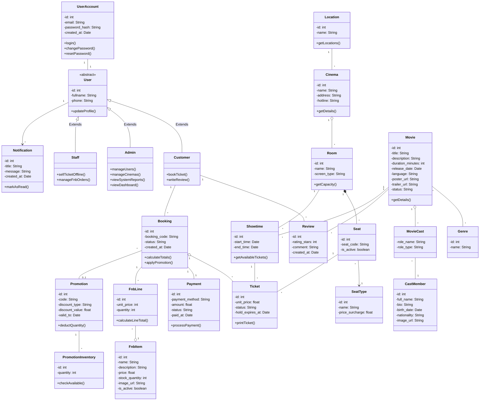

UML tung design pattern (GoF) **khong** gop vao file nay — moi pattern co `classDiagram` rieng trong [plans/01](plans/01-chain-of-responsibility-checkout-validation.md) … [plans/07](plans/07-prototype-email-templates.md) va quy uoc [plans/00](plans/00-patterns-conventions.md).

**Sau khi ap dung pattern:** moi pattern van co **UML rieng** trong `plans/01` … `plans/07` — **khong** gop nhieu pattern vao mot diagram hay gop pattern sau vao diagram pattern truoc. Chi muc: [uml-patterns-index.md](uml-patterns-index.md).