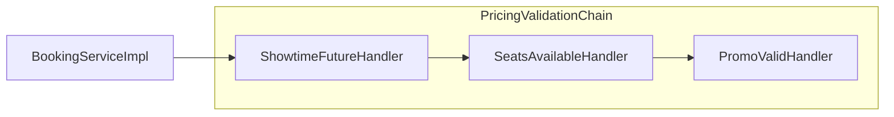

# Dynamic Pricing Engine — Chain of Responsibility

> Tài liệu tổng quan: [../08-dynamic-pricing-engine.md](../08-dynamic-pricing-engine.md)  
> Pattern chung trong repo (ví dụ checkout): [../01-chain-of-responsibility.md](../01-chain-of-responsibility.md)

## Giới thiệu

Trong luồng `POST /api/booking/calculate`, **Chain of Responsibility (CoR)** tách phần **kiểm tra điều kiện** trước khi tính giá: suất chiếu hợp lệ, ghế còn trống, mã khuyến mãi (nếu có). Chuỗi handler cập nhật `PricingValidationContext` (showtime, promotion) để tầng sau không phải load lại không cần thiết.

## Lý thuyết

**Chain of Responsibility** (nhóm Behavioral): nhiều handler nối thành chuỗi; mỗi handler xử lý một trách nhiệm, rồi chuyển tiếp cho handler kế tiếp. Caller chỉ gọi vào **đầu chuỗi**. Ở đây, nếu validate thất bại thì handler **ném exception** và luồng dừng (không có “bỏ qua lỗi” trong chain).

## Luồng hoạt động

1. `BookingServiceImpl.calculatePrice` tạo `PricingValidationContext` (chỉ gắn `request` ban đầu).
2. Gọi `pricingValidationChain.validate(validationCtx)` — bean đầu chuỗi là `ShowtimeFutureHandler`.
3. Sau khi chain **thành công**, service có thể **gọi lại** `resolvePromotionForPricing` nếu có `promoCode` (bước này **không** thuộc CoR; mục đích đồng bộ promotion ngay trước khi build context tính giá).
4. Tiếp theo: `PricingContextBuilder.build` → `IPricingEngine` (xem tài liệu tổng).

## File, chức năng và symbol cần nhớ

| Đường dẫn | Vai trò |
|-----------|---------|
| [backend/src/main/java/com/cinema/booking/services/impl/BookingServiceImpl.java](../../../backend/src/main/java/com/cinema/booking/services/impl/BookingServiceImpl.java) | `calculatePrice`: tạo context, gọi chain, re-resolve promo, gọi engine |
| [backend/.../validation/PricingValidationHandler.java](../../../backend/src/main/java/com/cinema/booking/services/strategy_decorator/pricing/validation/PricingValidationHandler.java) | Interface: `setNext`, `validate` |
| [backend/.../validation/AbstractPricingValidationHandler.java](../../../backend/src/main/java/com/cinema/booking/services/strategy_decorator/pricing/validation/AbstractPricingValidationHandler.java) | `doValidate` rồi `next.validate` |
| [backend/.../validation/PricingValidationConfig.java](../../../backend/src/main/java/com/cinema/booking/services/strategy_decorator/pricing/validation/PricingValidationConfig.java) | Bean `pricingValidationChain`: nối thứ tự handler |
| [backend/.../validation/PricingValidationContext.java](../../../backend/src/main/java/com/cinema/booking/services/strategy_decorator/pricing/validation/PricingValidationContext.java) | `request`, `showtime`, `promotion` |
| [backend/.../validation/ShowtimeFutureHandler.java](../../../backend/src/main/java/com/cinema/booking/services/strategy_decorator/pricing/validation/ShowtimeFutureHandler.java) | Load showtime, chưa chiếu, `setShowtime` |
| [backend/.../validation/SeatsAvailableHandler.java](../../../backend/src/main/java/com/cinema/booking/services/strategy_decorator/pricing/validation/SeatsAvailableHandler.java) | Ghế chưa bán cho `showtimeId` |
| [backend/.../validation/PromoValidHandler.java](../../../backend/src/main/java/com/cinema/booking/services/strategy_decorator/pricing/validation/PromoValidHandler.java) | Promo tồn tại, còn hạn, còn lượt; `setPromotion` |

**Cần nhớ**

- Thứ tự chain: `ShowtimeFutureHandler` → `SeatsAvailableHandler` → `PromoValidHandler` (`PricingValidationConfig`).
- Field `showtime` được populate ở handler đầu; handler ghế dùng `request.getShowtimeId()` và `seatIds`.
- Bean inject vào service: `@Qualifier("pricingValidationChain")`.

**UML / báo cáo:** [../../../UML/08-dynamic-pricing-engine.md](../../../UML/08-dynamic-pricing-engine.md)
