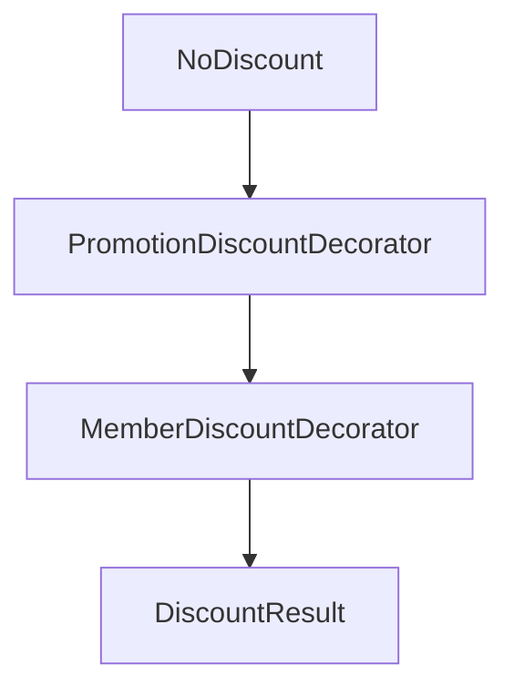

# Dynamic Pricing Engine — Decorator

> Tài liệu tổng quan: [../08-dynamic-pricing-engine.md](../08-dynamic-pricing-engine.md)

## Giới thiệu

Sau khi Strategy tính **subtotal**, **Decorator** xếp chồng các bước **giảm giá**: không giảm nền → (tuỳ chọn) promotion → (tuỳ chọn) hạng thành viên. Mỗi lớp bọc `DiscountComponent` bên trong, gọi `applyDiscount` theo thứ tự lồng nhau.

## Lý thuyết

**Decorator** (nhóm Structural): thêm hành vi động bằng cách bọc object cùng interface; có thể xếp nhiều lớp. Ở đây pipeline discount trả về `DiscountResult` (tổng discount + tách promotion vs membership).

## Luồng hoạt động

1. `PricingEngine.buildDiscountChain(context)`:
   - Bắt đầu từ `NoDiscount` (Spring bean).
   - Nếu `context.getPromotion() != null` → bọc `PromotionDiscountDecorator`.
   - Nếu `hasMemberDiscount(context)` (customer + tier + `discountPercent > 0`) → bọc `MemberDiscountDecorator`.
2. `discountChain.applyDiscount(subtotal, context)` → `DiscountResult`.
3. `calculateTotalPrice`: `finalTotal = subtotal - totalDiscount`; nếu âm thì **kẹp** về `0` và điều chỉnh discount tương ứng.
4. `buildAppliedStrategyLabel` thêm nhãn `PROMO`, `MEMBER_DISCOUNT` khi áp dụng.

(Thực tế: promotion / member chỉ có khi điều kiện thỏa; chain có thể chỉ là `NoDiscount`.)

## File, chức năng và symbol cần nhớ

| Đường dẫn | Vai trò |
|-----------|---------|
| [backend/.../pricing/DiscountComponent.java](../../../backend/src/main/java/com/cinema/booking/services/strategy_decorator/pricing/DiscountComponent.java) | `applyDiscount(subtotal, context)` |
| [backend/.../pricing/DiscountResult.java](../../../backend/src/main/java/com/cinema/booking/services/strategy_decorator/pricing/DiscountResult.java) | `totalDiscount`, `promotionDiscount`, `membershipDiscount` |
| [backend/.../pricing/NoDiscount.java](../../../backend/src/main/java/com/cinema/booking/services/strategy_decorator/pricing/NoDiscount.java) | Trả discount toàn 0 |
| [backend/.../pricing/BaseDiscountDecorator.java](../../../backend/src/main/java/com/cinema/booking/services/strategy_decorator/pricing/BaseDiscountDecorator.java) | `wrapped`, mặc định delegate `applyDiscount` |
| [backend/.../pricing/PromotionDiscountDecorator.java](../../../backend/src/main/java/com/cinema/booking/services/strategy_decorator/pricing/PromotionDiscountDecorator.java) | PERCENT hoặc FIXED; không vượt phần còn lại của subtotal sau discount trước |
| [backend/.../pricing/MemberDiscountDecorator.java](../../../backend/src/main/java/com/cinema/booking/services/strategy_decorator/pricing/MemberDiscountDecorator.java) | % theo `MembershipTier`; trên phần còn lại sau promotion |
| [backend/.../pricing/PricingEngine.java](../../../backend/src/main/java/com/cinema/booking/services/strategy_decorator/pricing/PricingEngine.java) | `buildDiscountChain`, `hasMemberDiscount`, clamp total, label |

**Cần nhớ**

- `PromotionDiscountDecorator` dùng `Promotion.DiscountType.PERCENT` / `FIXED` và `getDiscountValue()`.
- `MemberDiscountDecorator` dùng `tier.getDiscountPercent()` trên **remaining** sau `currentDiscount`.
- DTO trả về: `discountAmount` = tổng discount; `membershipDiscount` riêng; `appliedStrategy` mô tả nhánh đã dùng ([PriceBreakdownDTO](../../../backend/src/main/java/com/cinema/booking/dtos/PriceBreakdownDTO.java)).

**UML / báo cáo:** [../../../UML/08-dynamic-pricing-engine.md](../../../UML/08-dynamic-pricing-engine.md)
