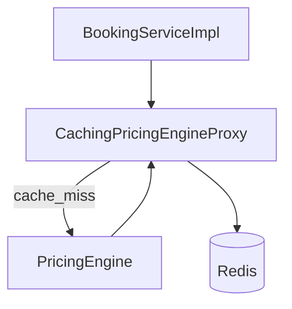

# Dynamic Pricing Engine — Proxy

> Tài liệu tổng quan: [../08-dynamic-pricing-engine.md](../08-dynamic-pricing-engine.md)  
> **Lưu ý:** Pattern Proxy chung (movie caching) đã được xóa khỏi dự án. Đây là phiên bản Proxy riêng cho pricing engine với Redis cache.

## Giới thiệu

**Proxy** bọc `PricingEngine` thật để thêm **cache Redis** cho kết quả `calculateTotalPrice`. Mọi nơi inject `IPricingEngine` nhận proxy `@Primary` mà không đổi code caller.

## Lý thuyết

**Proxy** (nhóm Structural): một đối tượng đứng trước **subject thật** (*Real subject*), **cùng interface** với subject thật, có thể thêm hành vi (ở đây: đọc/ghi cache trước và sau khi gọi delegate).

Ánh xạ GoF → code:

| Vai trò | Class |
|---------|--------|
| **Subject** (interface) | `IPricingEngine` |
| **Real subject** (đối tượng thật) | `PricingEngine` — bean `pricingEngine`, thực hiện strategy + decorator |
| **Proxy** | `CachingPricingEngineProxy` — bean `@Primary`, field `delegate` trỏ `PricingEngine` |

## Luồng hoạt động

1. `BookingServiceImpl` gọi `pricingEngine.calculateTotalPrice(pricingContext)` — kiểu `IPricingEngine`.
2. Spring inject `CachingPricingEngineProxy` (bean `@Primary`).
3. Proxy `buildCacheKey(context)` → `RedisTemplate.get`. Nếu hit và là `PriceBreakdownDTO` → trả luôn.
4. Miss → `delegate.calculateTotalPrice(context)` (`PricingEngine`, qualifier `pricingEngine`) → `set` Redis với TTL → trả DTO.

## File, chức năng và symbol cần nhớ

| Đường dẫn | Vai trò |
|-----------|---------|
| [backend/.../pricing/IPricingEngine.java](../../../backend/src/main/java/com/cinema/booking/services/strategy_decorator/pricing/IPricingEngine.java) | Interface chung cho proxy và engine |
| [backend/.../pricing/CachingPricingEngineProxy.java](../../../backend/src/main/java/com/cinema/booking/services/strategy_decorator/pricing/CachingPricingEngineProxy.java) | Proxy + Redis, `@Primary` |
| [backend/.../pricing/PricingEngine.java](../../../backend/src/main/java/com/cinema/booking/services/strategy_decorator/pricing/PricingEngine.java) | Subject thật, `@Component("pricingEngine")` |

**Cần nhớ**

- `KEY_PREFIX = "pricing:"`.
- `buildCacheKey`: `showtimeId`, ghế **đã sort** `seatId`, F&B **sort theo itemId** (`itemId:qty`), `promo:code` hoặc `none`, `cust:userId` hoặc `anon`.
- TTL: property `cinema.app.redisTtlSeconds`, mặc định **600** giây.
- Constructor proxy: `@Qualifier("pricingEngine") IPricingEngine delegate` — tránh vòng lặp bean.

**UML / báo cáo:** [../../../UML/08-dynamic-pricing-engine.md](../../../UML/08-dynamic-pricing-engine.md)
