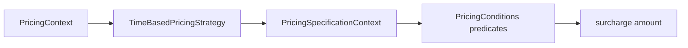

# Dynamic Pricing Engine — Specification

> Tài liệu tổng quan: [../08-dynamic-pricing-engine.md](../08-dynamic-pricing-engine.md)  
> **Lưu ý:** Pattern Specification chung (showtime filtering) đã được xóa khỏi dự án. Đây là phiên bản Specification riêng cho pricing engine.

## Giới thiệu

**Specification** ở đây là tập **predicate** (`Predicate<PricingSpecificationContext>`) mô tả điều kiện nghiệp vụ (cuối tuần, ngày lễ, …). Trong engine, phần **phụ thu theo thời gian** dùng các predicate này để quyết định có áp phần trăm surcharge hay không.

## Lý thuyết

**Specification** (thường gom vào domain logic): đóng gói điều kiện thành object có thể kết hợp (`and`, `or`, `negate`). Codebase dùng `java.util.function.Predicate` và factory tĩnh trong `PricingConditions`, không truy cập DB.

## Luồng hoạt động

1. `PricingEngine` gọi `TimeBasedPricingStrategy.calculate(context)`.
2. Strategy map `PricingContext` → `PricingSpecificationContext` qua `toSpecContext` (showtime, seats, customer, promotion, tổng F&B, occupancy, `bookingTime`).
3. Áp `PricingConditions.isHoliday()` và `isWeekend()` trên `specCtx`.
4. Nếu không phải holiday và không phải weekend → surcharge `0`.
5. Nếu có: **holiday được ưu tiên** khi chọn tỷ lệ (`holidaySurchargePct` thay vì `weekendSurchargePct`). Surcharge tính trên tổng tiền vé (base + surcharge loại ghế) theo phần trăm cấu hình.

**Lưu ý:** `PricingConditions` còn `isEarlyBird()`, `isHighOccupancy(int)`, hằng `EARLY_BIRD_DAYS`, `VIETNAMESE_HOLIDAYS` — **phần surcharge hiện tại chỉ dùng weekend/holiday**; các predicate khác là nền tảng mở rộng / ghi chú TODO trong code.

## File, chức năng và symbol cần nhớ

| Đường dẫn | Vai trò |
|-----------|---------|
| [backend/.../specification/PricingConditions.java](../../../backend/src/main/java/com/cinema/booking/patterns/specification/PricingConditions.java) | Factory predicate: `isWeekend`, `isHoliday`, `isEarlyBird`, `isHighOccupancy` |
| [backend/.../specification/PricingSpecificationContext.java](../../../backend/src/main/java/com/cinema/booking/patterns/specification/PricingSpecificationContext.java) | Value object immutable cho predicate |
| [backend/.../pricing/TimeBasedPricingStrategy.java](../../../backend/src/main/java/com/cinema/booking/services/strategy_decorator/pricing/TimeBasedPricingStrategy.java) | `toSpecContext`, áp predicate, tính % surcharge |
| [backend/.../pricing/PricingLineType.java](../../../backend/src/main/java/com/cinema/booking/services/strategy_decorator/pricing/PricingLineType.java) | `TIME_BASED_SURCHARGE` |

**Cần nhớ**

- Config: `cinema.pricing.weekend-surcharge-pct` (mặc định 15), `cinema.pricing.holiday-surcharge-pct` (mặc định 20).
- Trong class `PricingConditions`: `EARLY_BIRD_DAYS`, `VIETNAMESE_HOLIDAYS` (tập `MonthDay` cố định).

**UML / báo cáo:** [../../../UML/08-dynamic-pricing-engine.md](../../../UML/08-dynamic-pricing-engine.md)
