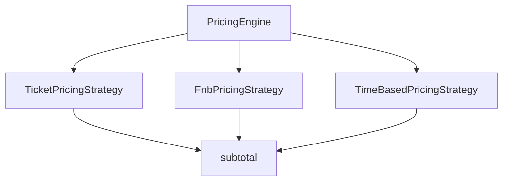

# Dynamic Pricing Engine — Strategy

> Tài liệu tổng quan: [../08-dynamic-pricing-engine.md](../08-dynamic-pricing-engine.md)

## Giới thiệu

**Strategy** tách cách tính từng **thành phần giá** (vé, F&B, phụ thu thời gian) theo interface thống nhất. `PricingEngine` orchestrator gọi lần lượt từng strategy theo `PricingLineType` rồi cộng subtotal trước khi qua chuỗi giảm giá (Decorator).

## Lý thuyết

**Strategy** (nhóm Behavioral): định nghĩa họ thuật toán, encapsulate từng biến thể, cho phép chọn algorithm lúc runtime. Ở đây mỗi `PricingLineType` có đúng một implementation Spring `@Component`.

## Luồng hoạt động

1. `PricingEngine` nhận `List<PricingStrategy>` qua constructor, đưa vào `EnumMap<PricingLineType, PricingStrategy>`.
2. `calculateTotalPrice`:
   - `ticketTotal` = strategy `TICKET`
   - `fnbTotal` = strategy `FNB`
   - `timeBasedSurcharge` = strategy `TIME_BASED_SURCHARGE`
3. `subtotal = ticketTotal + fnbTotal + timeBasedSurcharge` → chuyển sang `DiscountComponent.applyDiscount` (xem [decorator.md](decorator.md)).

Constructor `PricingEngine` **throw** nếu thiếu strategy cho bất kỳ `PricingLineType` nào hoặc trùng `lineType()`.

## File, chức năng và symbol cần nhớ

| Đường dẫn | Vai trò |
|-----------|---------|
| [backend/.../pricing/PricingStrategy.java](../../../backend/src/main/java/com/cinema/booking/services/strategy_decorator/pricing/PricingStrategy.java) | `lineType()`, `calculate(PricingContext)` |
| [backend/.../pricing/PricingEngine.java](../../../backend/src/main/java/com/cinema/booking/services/strategy_decorator/pricing/PricingEngine.java) | Map strategy, orchestrate, build DTO |
| [backend/.../pricing/TicketPricingStrategy.java](../../../backend/src/main/java/com/cinema/booking/services/strategy_decorator/pricing/TicketPricingStrategy.java) | Base price showtime + surcharge loại ghế × số ghế |
| [backend/.../pricing/FnbPricingStrategy.java](../../../backend/src/main/java/com/cinema/booking/services/strategy_decorator/pricing/FnbPricingStrategy.java) | Tổng `ResolvedFnbItem` (giá đã resolve ở builder) |
| [backend/.../pricing/TimeBasedPricingStrategy.java](../../../backend/src/main/java/com/cinema/booking/services/strategy_decorator/pricing/TimeBasedPricingStrategy.java) | Phụ thu cuối tuần / lễ (Specification) |
| [backend/.../pricing/PricingContext.java](../../../backend/src/main/java/com/cinema/booking/services/strategy_decorator/pricing/PricingContext.java) | Dữ liệu đầu vào orchestration |
| [backend/.../pricing/PricingContextBuilder.java](../../../backend/src/main/java/com/cinema/booking/services/strategy_decorator/pricing/PricingContextBuilder.java) | Build `PricingContext` sau validation |

**Cần nhớ**

- `strategiesByLine`: `EnumMap` đảm bảo mỗi `PricingLineType` một entry.
- `TicketPricingStrategy` / `FnbPricingStrategy` guard `null` list → `ZERO`.

**Output DTO:** [backend/.../dtos/PriceBreakdownDTO.java](../../../backend/src/main/java/com/cinema/booking/dtos/PriceBreakdownDTO.java) — `ticketTotal`, `fnbTotal`, `timeBasedSurcharge`, …

**UML / báo cáo:** [../../../UML/08-dynamic-pricing-engine.md](../../../UML/08-dynamic-pricing-engine.md)
