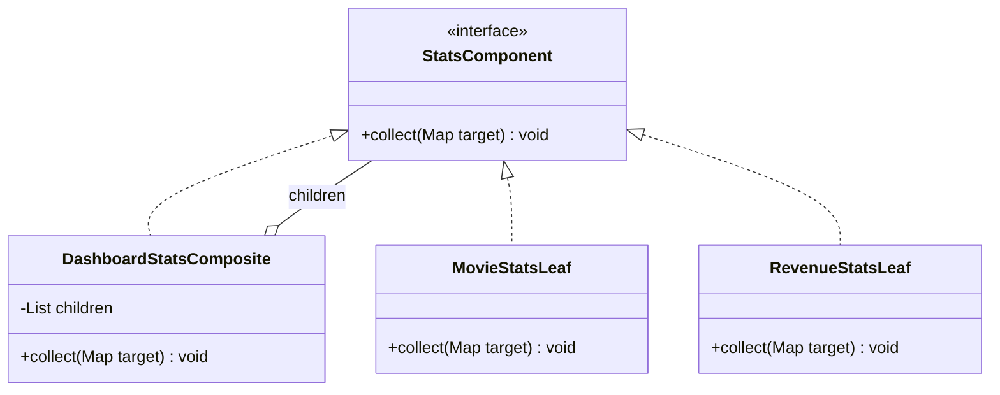
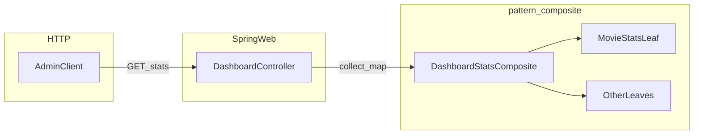
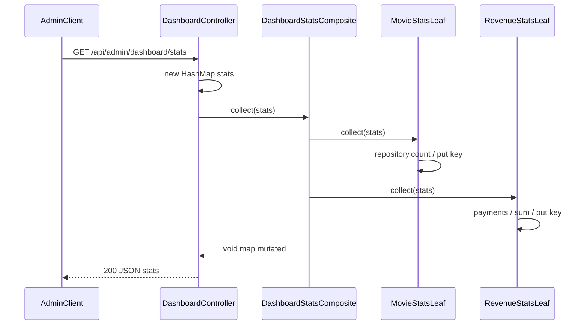

# Gói `pattern.composite` — Thống kê dashboard (Composite Pattern)

Tài liệu này mô tả **đầy đủ** package `com.cinema.booking.pattern.composite`: vai trò từng file, cách Spring nối bean, luồng API admin, và cách đọc mã nguồn. Lý thuyết pattern tổng quát xem thêm [05-composite.md](./05-composite.md).

Nếu bạn **mới làm quen** với lập trình hoặc với dự án này, hãy đọc mục **0** bên dưới trước; các mục sau dùng thuật ngữ nhiều hơn một chút.

---

## 0. Giải thích cho người mới

*(Đọc mục này trước cũng được — không cần nền lập trình sâu.)*

### Câu chuyện bằng lời thường

Trang **quản trị** của rạp chiếu phim muốn hiện một ô tổng hợp: có bao nhiêu phim, bao nhiêu vé, bao nhiêu suất chiếu, doanh thu bao nhiêu… Thay vì nhét hết “cách lấy từng con số” vào **một** chỗ dài và rối, người ta **chia nhỏ**:

- Mỗi **mảnh** chỉ trả lời **một câu hỏi** (ví dụ chỉ đếm phim).
- Có một **người điều phối** đi hỏi lần lượt từng mảnh, rồi **ghép** câu trả lời vào **một tờ giấy** (trong code gọi là `Map` — giống bảng hai cột: tên chỉ số → giá trị).

Khi admin mở dashboard, máy chủ chỉ cần nói: “Điều phối ơi, điền giúp tờ thống kê này” — **một lần** — là đủ mọi con số.

### Ví dụ đời thường (dễ nhớ)

Tưởng tượng **báo cáo cuối ngày** cửa hàng:

- Người A chỉ đếm **số hàng trong kho**.
- Người B chỉ đếm **số hóa đơn**.
- Người C chỉ cộng **tiền mặt trong ngăn kéo**.

**Quản lý** không tự đếm tất cả; quản lý chỉ đi **gọi từng người** và ghi vào **một phiếu tổng**. Thư mục `composite` trong code đang làm đúng việc đó: nhiều “người nhỏ” (leaf) + một “quản lý gom” (composite).

### Vài từ kỹ thuật — giải thích tối giản

| Từ trong tài liệu | Ý đơn giản |
|-------------------|------------|
| **API** | Đường dẫn trên máy chủ mà trang web gọi để **lấy dữ liệu** (ví dụ danh sách số liệu). |
| **JSON** | Kiểu **văn bản** máy tính dùng để truyền dữ liệu; trông giống `{ "totalMovies": 12 }`. |
| **Spring / bean** | Framework giúp **tự tạo và nối** các phần code với nhau; `@Component` nghĩa là “Spring hãy quản lý giúp class này”. |
| **Repository** | Lớp nói chuyện với **cơ sở dữ liệu** (đếm, tìm, lưu…). |
| **Composite Pattern** | Cách tổ chức: **một kiểu việc** (`collect`) dùng cho **từng mảnh nhỏ** lẫn **cả nhóm** — phía ngoài không cần biết bên trong có bao nhiêu mảnh. |

### Trong code, chuyện xảy ra theo 3 bước (đủ để hiểu ý)

1. Trang admin gọi đường dẫn lấy thống kê (ở dự án là `GET /api/admin/dashboard/stats`).
2. **Controller** tạo một “phiếu trống” (`HashMap`) rồi nhờ **điều phối** `DashboardStatsComposite` điền.
3. Điều phối **lần lượt** nhờ từng **leaf** (ví dụ `MovieStatsLeaf`) đếm trong database và **ghi một dòng** lên phiếu (ví dụ `totalMovies`).

Bạn **chưa cần** hiểu hết từng dòng Java; chỉ cần nhớ: **một chỗ gọi**, **nhiều mảnh nhỏ làm việc**, **kết quả là một bảng số** gửi về trình duyệt.

### Sau mục 0, nên đọc tiếp thế nào?

- Muốn **hình dung cấu trúc**: xem mục [4. Sơ đồ](#4-sơ-đồ-cấu-trúc-và-luồng-gọi) (hình Mermaid).
- Muốn **biết từng file làm gì**: xem mục [7. Chi tiết từng file](#7-chi-tiết-từng-file-trong-package).
- Muốn **lý thuyết pattern** rộng hơn: [05-composite.md](./05-composite.md).

---

## Mục lục

0. [Giải thích cho người mới](#0-giải-thích-cho-người-mới)
1. [Tóm tắt nhanh](#1-tóm-tắt-nhanh)
2. [Bối cảnh và lợi ích thiết kế](#2-bối-cảnh-và-lợi-ích-thiết-kế)
3. [Ánh xạ GoF Composite → mã dự án](#3-ánh-xạ-gof-composite--mã-dự-án)
4. [Sơ đồ cấu trúc và luồng gọi](#4-sơ-đồ-cấu-trúc-và-luồng-gọi)
5. [Luồng HTTP và hợp đồng JSON](#5-luồng-http-và-hợp-đồng-json)
6. [Spring Dependency Injection](#6-spring-dependency-injection)
7. [Chi tiết từng file trong package](#7-chi-tiết-từng-file-trong-package)
8. [RevenueStatsLeaf — xử lý doanh thu](#8-revenuestatsleaf--xử-lý-doanh-thu)
9. [Mở rộng, checklist và gợi ý kiểm thử](#9-mở-rộng-checklist-và-gợi-ý-kiểm-thử)
10. [Bảng tra cứu key JSON](#10-bảng-tra-cứu-key-json)

---

## 1. Tóm tắt nhanh

- **Package:** `backend/src/main/java/com/cinema/booking/pattern/composite/`.
- **Mục đích:** Gom nhiều nguồn số liệu dashboard (đếm entity, tổng doanh thu…) vào **một thao tác** `collect(Map)` thống nhất — đúng tinh thần **Composite Pattern** (client không phân biệt “một mảnh” hay “cả nhóm”).
- **Điểm vào API:** `GET /api/admin/dashboard/stats` — controller tạo `HashMap`, gọi `dashboardStatsComposite.collect(stats)`, trả JSON.
- **Cách mở rộng:** Thêm class mới `implements StatsComponent` + `@Component`; không bắt buộc sửa composite hay controller (Spring tự gom bean).

---

## 2. Bối cảnh và lợi ích thiết kế

### Vấn đề thường gặp

Nếu viết hết logic thống kê trong controller (gọi lần lượt nhiều repository), controller sẽ:

- Phụ thuộc quá nhiều dependency (**coupling** cao, khó đọc).
- Mỗi lần thêm chỉ số mới phải mở controller (**vi phạm Open/Closed** nếu coi controller là điểm ổn định).
- Khó tái sử dụng hoặc test từng “mảnh” thống kê độc lập.

### Cách package này giải quyết

- **Single Responsibility:** Controller chỉ điều phối HTTP; từng leaf chỉ lo **một** loại số liệu; composite chỉ lo **lặp và gọi** `collect`.
- **Open/Closed:** Thêm leaf mới không cần sửa `DashboardStatsComposite` (vẫn inject `List<StatsComponent>`).
- **Thống nhất giao diện:** Mọi thành phần đều là `StatsComponent` → dễ mock trong test, dễ hình dung cây thống kê.

> **Ghi chú:** Phần “trước / sau” và ví dụ anti-pattern minh họa nằm trong [05-composite.md](./05-composite.md) mục lý thuyết và ví dụ controller cũ.

---

## 3. Ánh xạ GoF Composite → mã dự án

| Vai trò GoF | Class / interface trong dự án |
|-------------|-------------------------------|
| **Component** | `StatsComponent` — hợp đồng `collect(Map<String, Object> target)` |
| **Composite** | `DashboardStatsComposite` — giữ `List<StatsComponent>`, lần lượt gọi `collect` |
| **Leaf** | `MovieStatsLeaf`, `UserStatsLeaf`, `ShowtimeStatsLeaf`, `FnbStatsLeaf`, `TicketStatsLeaf`, `PromotionStatsLeaf`, `RevenueStatsLeaf` |

Trong biến thể này, **không có composite lồng composite** (chỉ một tầng composite + nhiều leaf), đủ cho dashboard đơn giản và vẫn đúng pattern.

---

## 4. Sơ đồ cấu trúc và luồng gọi

### Class diagram (rút gọn)



### Luồng dữ liệu (từ request đến map)



### Sequence diagram (một lần gọi `getStats`)



---

## 5. Luồng HTTP và hợp đồng JSON

### Endpoint

| Thuộc tính | Giá trị |
|------------|---------|
| Method | `GET` |
| Path | `/api/admin/dashboard/stats` |
| Controller | [`DashboardController`](../../backend/src/main/java/com/cinema/booking/controller/DashboardController.java) |

Đoạn điều phối thực tế:

```31:37:backend/src/main/java/com/cinema/booking/controller/DashboardController.java
    @Operation(summary = "Lấy số liệu tổng quan hệ thống")
    @GetMapping("/stats")
    public ResponseEntity<Map<String, Object>> getStats() {
        Map<String, Object> stats = new HashMap<>();
        dashboardStatsComposite.collect(stats);
        return ResponseEntity.ok(stats);
    }
```

- Mỗi request dùng **một** `HashMap` mới → không chia sẻ state giữa các request.
- `ResponseEntity.ok(stats)` để Spring/Jackson serialize `Map<String, Object>` thành JSON.

### Ví dụ JSON (minh họa)

```json
{
  "totalMovies": 12,
  "totalUsers": 340,
  "totalShowtimes": 156,
  "totalFnbItems": 24,
  "totalTickets": 8901,
  "totalPromotions": 5,
  "totalRevenue": 125000000.50
}
```

**Kiểu dữ liệu (ý nghĩa khi serialize):**

- Các key từ `repository.count()` thường là **`Long`** trong JSON (số nguyên).
- `totalRevenue` là **`BigDecimal`** trong JVM → JSON thường là số thập phân (Jackson có thể xuất dạng số hoặc chuỗi tùy cấu hình global; mặc định phổ biến là số).

> **Lưu ý cho client:** Không nên phụ thuộc vào **thứ tự key** trong object JSON. Luôn đọc theo tên key.

> **API khác:** `GET /api/admin/dashboard/revenue-weekly` vẫn dùng `PaymentRepository` trực tiếp trong controller — **chưa** gộp vào composite (xem comment trên field trong controller).

---

## 6. Spring Dependency Injection

### Bean nào được đăng ký?

- Mọi class leaf và `DashboardStatsComposite` đều có `@Component` → Spring tạo **một singleton** mỗi loại (mặc định scope).
- `StatsComponent` là interface → Spring không tạo bean cho interface, chỉ cho các implementation.

### Constructor `DashboardStatsComposite(List<StatsComponent> allComponents)`

Spring Framework (kể từ các phiên bản dùng phổ biến với Boot) hỗ trợ inject **tất cả** bean khớp kiểu `StatsComponent` vào `List`:

- Danh sách gồm **tất cả** leaf **và** chính `DashboardStatsComposite` (vì composite cũng `implements StatsComponent`).

### Tại sao phải `filter` bỏ chính composite?

```17:21:backend/src/main/java/com/cinema/booking/pattern/composite/DashboardStatsComposite.java
    public DashboardStatsComposite(List<StatsComponent> allComponents) {
        // Loại bỏ chính bean này để tránh đệ quy
        this.children = allComponents.stream()
                .filter(c -> !(c instanceof DashboardStatsComposite))
                .collect(Collectors.toList());
```

Nếu **không** lọc: `collect` → vòng lặp gọi lại `DashboardStatsComposite.collect` → **đệ quy vô hạn** → `StackOverflowError`.

> **Thiết kế:** Dùng `instanceof DashboardStatsComposite` là cố định theo class; nếu sau này có **nhiều tầng** composite, cần chiến lược lọc rõ ràng hơn (ví dụ marker interface, hoặc không cho composite nằm trong list chung).

### Thứ tự gọi `collect`

Thứ tự phần tử trong `List<StatsComponent>` phụ thuộc Spring (thường ổn định theo classpath / tên bean, **không** được coi là hợp đồng API). Các leaf ghi **key khác nhau** nên không bị ghi đè lẫn nhau.

---

## 7. Chi tiết từng file trong package

### 7.1. `StatsComponent.java` — Component (interface)

**Vai trò:** Hợp đồng chung cho mọi nút trong “cây” thống kê: leaf và composite đều triển khai cùng một phương thức.

**Ý nghĩa `collect(Map<String, Object> target)`:**

- Map được truyền **từ ngoài vào** (mutation): mỗi component **bổ sung** key/value của mình.
- Không return map mới → tránh cấp phát và dễ gom trong một response.

```1:10:backend/src/main/java/com/cinema/booking/pattern/composite/StatsComponent.java
package com.cinema.booking.pattern.composite;

import java.util.Map;

/**
 * Thành phần composite (dashboard): leaf hoặc composite đều ghi số liệu vào map đích.
 */
public interface StatsComponent {
    void collect(Map<String, Object> target);
}
```

---

### 7.2. `DashboardStatsComposite.java` — Composite

**Vai trò:** Điểm vào duy nhất mà controller gọi; ủy quyền cho tất cả `StatsComponent` con (trừ chính nó).

**Annotation:** `@Component` — đăng ký bean Spring.

**Phụ thuộc:** `List<StatsComponent>` (toàn bộ implementation, kể cả bản thân trước khi lọc).

**Hành vi `collect`:** Vòng `for` tuần tự — đơn giản, dễ debug; không song song hóa (đủ cho dashboard nhỏ).

```12:29:backend/src/main/java/com/cinema/booking/pattern/composite/DashboardStatsComposite.java
@Component
public class DashboardStatsComposite implements StatsComponent {

    private final List<StatsComponent> children;

    public DashboardStatsComposite(List<StatsComponent> allComponents) {
        // Loại bỏ chính bean này để tránh đệ quy
        this.children = allComponents.stream()
                .filter(c -> !(c instanceof DashboardStatsComposite))
                .collect(Collectors.toList());
    }

    @Override
    public void collect(Map<String, Object> target) {
        for (StatsComponent child : children) {
            child.collect(target);
        }
    }
}
```

---

### 7.3. `ShowtimeStatsLeaf.java` — Leaf

| Mục | Nội dung |
|-----|----------|
| **Dữ liệu** | Tổng số bản ghi suất chiếu |
| **Repository** | `ShowtimeRepository` |
| **Key JSON** | `totalShowtimes` |
| **Annotation** | `@Component`, `@RequiredArgsConstructor` (Lombok sinh constructor `final` fields) |

```9:19:backend/src/main/java/com/cinema/booking/pattern/composite/ShowtimeStatsLeaf.java
/** Leaf: đếm tổng suất chiếu. */
@Component
@RequiredArgsConstructor
public class ShowtimeStatsLeaf implements StatsComponent {

    private final ShowtimeRepository showtimeRepository;

    @Override
    public void collect(Map<String, Object> target) {
        target.put("totalShowtimes", showtimeRepository.count());
    }
}
```

---

### 7.4. `TicketStatsLeaf.java` — Leaf

| Mục | Nội dung |
|-----|----------|
| **Dữ liệu** | Tổng số vé (bản ghi ticket) |
| **Repository** | `TicketRepository` |
| **Key JSON** | `totalTickets` |

```9:19:backend/src/main/java/com/cinema/booking/pattern/composite/TicketStatsLeaf.java
/** Leaf: đếm tổng số vé. */
@Component
@RequiredArgsConstructor
public class TicketStatsLeaf implements StatsComponent {

    private final TicketRepository ticketRepository;

    @Override
    public void collect(Map<String, Object> target) {
        target.put("totalTickets", ticketRepository.count());
    }
}
```

---

### 7.5. `MovieStatsLeaf.java` — Leaf

| Mục | Nội dung |
|-----|----------|
| **Dữ liệu** | Tổng số phim |
| **Repository** | `MovieRepository` |
| **Key JSON** | `totalMovies` |

```9:19:backend/src/main/java/com/cinema/booking/pattern/composite/MovieStatsLeaf.java
/** Leaf: đếm tổng số phim. */
@Component
@RequiredArgsConstructor
public class MovieStatsLeaf implements StatsComponent {

    private final MovieRepository movieRepository;

    @Override
    public void collect(Map<String, Object> target) {
        target.put("totalMovies", movieRepository.count());
    }
}
```

---

### 7.6. `PromotionStatsLeaf.java` — Leaf

| Mục | Nội dung |
|-----|----------|
| **Dữ liệu** | Tổng chương trình khuyến mãi |
| **Repository** | `PromotionRepository` |
| **Key JSON** | `totalPromotions` |

```9:19:backend/src/main/java/com/cinema/booking/pattern/composite/PromotionStatsLeaf.java
/** Leaf: đếm tổng khuyến mãi. */
@Component
@RequiredArgsConstructor
public class PromotionStatsLeaf implements StatsComponent {

    private final PromotionRepository promotionRepository;

    @Override
    public void collect(Map<String, Object> target) {
        target.put("totalPromotions", promotionRepository.count());
    }
}
```

---

### 7.7. `FnbStatsLeaf.java` — Leaf

| Mục | Nội dung |
|-----|----------|
| **Dữ liệu** | Số món đồ ăn/nước trong menu (F&B item) |
| **Repository** | `FnbItemRepository` |
| **Key JSON** | `totalFnbItems` |

```9:19:backend/src/main/java/com/cinema/booking/pattern/composite/FnbStatsLeaf.java
/** Leaf: đếm món F&B trong menu. */
@Component
@RequiredArgsConstructor
public class FnbStatsLeaf implements StatsComponent {

    private final FnbItemRepository fnbItemRepository;

    @Override
    public void collect(Map<String, Object> target) {
        target.put("totalFnbItems", fnbItemRepository.count());
    }
}
```

---

### 7.8. `UserStatsLeaf.java` — Leaf

| Mục | Nội dung |
|-----|----------|
| **Dữ liệu** | Tổng người dùng hệ thống |
| **Repository** | `UserRepository` |
| **Key JSON** | `totalUsers` |

```9:19:backend/src/main/java/com/cinema/booking/pattern/composite/UserStatsLeaf.java
/** Leaf: đếm tổng người dùng. */
@Component
@RequiredArgsConstructor
public class UserStatsLeaf implements StatsComponent {

    private final UserRepository userRepository;

    @Override
    public void collect(Map<String, Object> target) {
        target.put("totalUsers", userRepository.count());
    }
}
```

---

## 8. RevenueStatsLeaf — xử lý doanh thu

`RevenueStatsLeaf` khác các leaf chỉ `count()`: cần **lọc theo trạng thái thanh toán** và **cộng tiền**.

### Bảng nhanh

| Mục | Nội dung |
|-----|----------|
| **Dữ liệu** | Tổng số tiền các `Payment` có `PaymentStatus.SUCCESS` |
| **Repository** | `PaymentRepository` |
| **Key JSON** | `totalRevenue` |
| **Kiểu JVM** | `BigDecimal` (tránh sai số dấu phẩy động của `double`) |

### Luồng code

1. `findByStatus(Payment.PaymentStatus.SUCCESS)` — chỉ thanh toán thành công.
2. Stream `map(Payment::getAmount)` — lấy từng khoản.
3. `reduce(BigDecimal.ZERO, BigDecimal::add)` — cộng dồn an toàn với `null`-amount nếu có tùy entity (nên đảm bảo DB/entity không null trong thực tế).
4. `target.put("totalRevenue", revenue)`.

```12:28:backend/src/main/java/com/cinema/booking/pattern/composite/RevenueStatsLeaf.java
/** Leaf: tổng doanh thu từ các thanh toán thành công. */
@Component
@RequiredArgsConstructor
public class RevenueStatsLeaf implements StatsComponent {

    private final PaymentRepository paymentRepository;

    @Override
    public void collect(Map<String, Object> target) {
        List<Payment> successfulPayments = paymentRepository.findByStatus(Payment.PaymentStatus.SUCCESS);

        BigDecimal revenue = successfulPayments.stream()
                .map(Payment::getAmount)
                .reduce(BigDecimal.ZERO, BigDecimal::add);

        target.put("totalRevenue", revenue);
    }
}
```

### Trade-off (đọc hiểu, không đổi code trong tài liệu này)

- **Hiện tại:** Nạp toàn bộ danh sách payment thành công vào bộ nhớ rồi cộng — code ngắn, dễ đọc.
- **Khi dữ liệu lớn:** Có thể chuyển sang một query aggregation (`SUM(amount) … WHERE status = SUCCESS`) trong repository để giảm RAM và truyền tải.

---

## 9. Mở rộng, checklist và gợi ý kiểm thử

### Checklist thêm chỉ số mới

1. Tạo class `XyzStatsLeaf implements StatsComponent`.
2. Thêm `@Component` (và `@RequiredArgsConstructor` nếu inject repository).
3. Trong `collect`, chọn **key map duy nhất** (ví dụ `totalXyz`) — tránh trùng key với leaf khác → ghi đè im lặng.
4. Không cần sửa `DashboardStatsComposite` hay `DashboardController` (miễn là Spring quét được package component).

### Gợi ý kiểm thử

- **Đơn vị:** Mock `PaymentRepository` / `MovieRepository` và gọi trực tiếp `collect` trên `HashMap`, assert các key mong đợi.
- **Tích hợp nhẹ:** `@SpringBootTest` + `MockMvc` gọi `GET /api/admin/dashboard/stats` với dữ liệu test — kiểm tra đủ key và kiểu.
- **Composite:** Có thể test `DashboardStatsComposite` với `List.of(mockLeaf1, mockLeaf2)` (không cần context đầy đủ) để đảm bảo gọi đủ con và không đệ quy.

---

## 10. Bảng tra cứu key JSON

| Key | Class (Leaf) | Nguồn / ghi chú |
|-----|----------------|-----------------|
| `totalShowtimes` | `ShowtimeStatsLeaf` | `ShowtimeRepository.count()` |
| `totalTickets` | `TicketStatsLeaf` | `TicketRepository.count()` |
| `totalMovies` | `MovieStatsLeaf` | `MovieRepository.count()` |
| `totalPromotions` | `PromotionStatsLeaf` | `PromotionRepository.count()` |
| `totalFnbItems` | `FnbStatsLeaf` | `FnbItemRepository.count()` |
| `totalUsers` | `UserStatsLeaf` | `UserRepository.count()` |
| `totalRevenue` | `RevenueStatsLeaf` | Tổng `amount` của `Payment` `SUCCESS` |

---

## Tài liệu liên quan

- [05-composite.md](./05-composite.md) — lý thuyết Composite, ví dụ “trước khi refactor”, và ngữ cảnh dashboard trong dự án.
