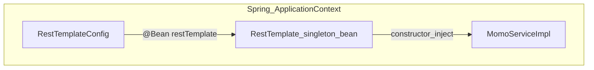
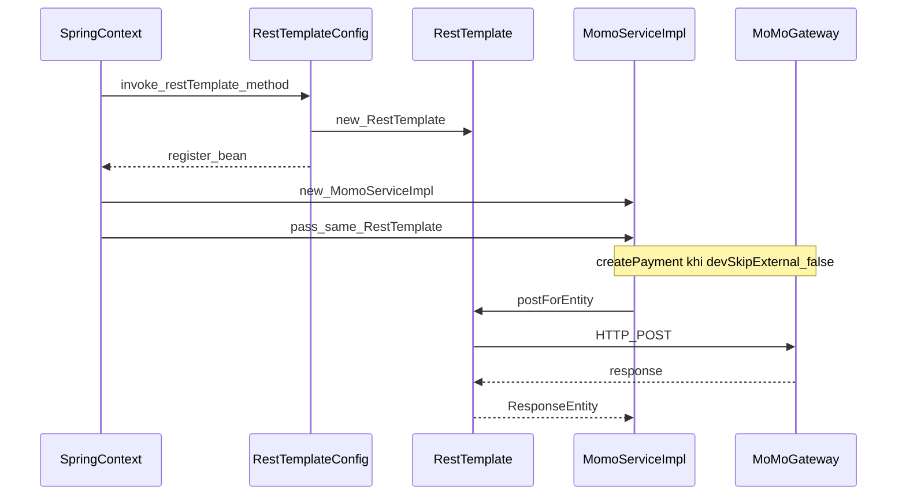

# Singleton trong dự án — Bean `RestTemplate` (Spring IoC)

Tài liệu này mô tả **cách dự án áp dụng ý tưởng Singleton** thông qua Spring: **một** instance `RestTemplate` dùng chung, khai báo tại cấu hình và inject vào service (hiện tại là `MomoServiceImpl`). Đây **không** phải một thư mục `pattern/singleton/` riêng — pattern nằm ở chỗ **Spring container** giữ bean **singleton scope** (mặc định).

Lý thuyết Singleton, anti-pattern `new RestTemplate()` lặp lại, và so sánh với Singleton “cổ điển” xem [06-singleton.md](./06-singleton.md). UML pattern-only: [../../UML/pattern-only/06-singleton.md](../../UML/pattern-only/06-singleton.md).

Nếu bạn **mới làm quen**, đọc **mục 0** trước.

---

## 0. Giải thích cho người mới

*(Không cần nền lập trình sâu để nắm ý chính.)*

### Chuyện gì đang xảy ra (lời thường)

Ứng dụng cần **gọi ra ngoài Internet** (ví dụ cổng thanh toán MoMo). Để gọi HTTP, code dùng công cụ tên **`RestTemplate`**. Thay vì mỗi lần cần lại **tạo mới** một `RestTemplate` (tốn tài nguyên, khó cấu hình thống nhất), dự án làm như sau:

- **Một lần** khi ứng dụng khởi động, Spring tạo **đúng một** `RestTemplate` và cất vào “kho” (container).
- Các class cần gọi HTTP chỉ **nhận kế thừa** object đó qua constructor (inject) — mọi nơi dùng **cùng một** instance.

### Ví dụ đời thường

Giống **một đường dây internet dùng chung** cho cả nhà: không lắp modem mới mỗi lần một người vào mạng. Ở đây “modem” là `RestTemplate`, Spring đảm bảo chỉ có **một** cái dùng chung.

### Vài từ kỹ thuật — giải thích tối giản

| Từ | Ý đơn giản |
|----|------------|
| **Spring / IoC** | Framework tạo object và **nối** chúng với nhau thay vì bạn tự `new` khắp nơi. |
| **`@Configuration`** | Class chứa “công thức” tạo bean cho Spring. |
| **`@Bean`** | Method trả về một object Spring sẽ **quản lý** (đăng ký vào container). |
| **Singleton scope (mặc định)** | Với mỗi **tên bean**, trong **một** ứng dụng Spring chỉ có **một** instance, dùng lại mãi đến khi tắt app. |
| **Inject / tiêm phụ thuộc** | Spring **đưa** sẵn `RestTemplate` vào constructor của service khi tạo service. |

### Ba bước (đủ để hình dung)

1. Spring đọc `RestTemplateConfig`, gọi method `restTemplate()` **một lần**, lưu kết quả.
2. Spring tạo `MomoServiceImpl` và **truyền** instance `RestTemplate` đó vào constructor.
3. Khi tạo thanh toán MoMo (và không bật chế độ dev bỏ qua gọi ngoài), service dùng **chính** `restTemplate` đó để `postForEntity`.

Sau mục 0, có thể đọc tiếp [1. Tóm tắt nhanh](#1-tóm-tắt-nhanh), [6. Spring Dependency Injection](#6-spring-dependency-injection), và [7. Chi tiết từng file](#7-chi-tiết-từng-file-liên-quan).

---

## Mục lục

0. [Giải thích cho người mới](#0-giải-thích-cho-người-mới)
1. [Tóm tắt nhanh](#1-tóm-tắt-nhanh)
2. [Singleton sách giáo khoa vs Spring](#2-singleton-sách-giáo-khoa-vs-spring)
3. [Sơ đồ luồng](#3-sơ-đồ-luồng)
4. [Luồng khởi động và request (mô tả)](#4-luồng-khởi-động-và-request-mô-tả)
5. [Phạm vi mã trong repo](#5-phạm-vi-mã-trong-repo)
6. [Spring Dependency Injection](#6-spring-dependency-injection)
7. [Chi tiết từng file liên quan](#7-chi-tiết-từng-file-liên-quan)
8. [Mở rộng, checklist và ghi chú dev-skip-external](#8-mở-rộng-checklist-và-ghi-chú-dev-skip-external)
9. [Bảng tra cứu bean](#9-bảng-tra-cứu-bean)

---

## 1. Tóm tắt nhanh

| Khía cạnh | Nội dung |
|-----------|----------|
| **Vấn đề nếu không dùng bean** | `new RestTemplate()` ở nhiều chỗ → nhiều object, khó cấu hình timeout/interceptor thống nhất, overhead (xem [06-singleton.md](./06-singleton.md)). |
| **Cách dự án làm** | [`RestTemplateConfig`](../../backend/src/main/java/com/cinema/booking/config/RestTemplateConfig.java) khai báo `@Bean` `RestTemplate`; [`MomoServiceImpl`](../../backend/src/main/java/com/cinema/booking/service/impl/MomoServiceImpl.java) nhận qua constructor và dùng khi gọi MoMo thật. |
| **Consumer hiện tại** | Trong repo, **chỉ** `MomoServiceImpl` inject `RestTemplate` (đã rà `grep` toàn `backend`). Service khác cần HTTP có thể inject cùng bean sau này. |
| **Lợi ích** | Một điểm cấu hình tương lai; một instance dùng chung trong JVM (singleton scope mặc định của Spring). |

---

## 2. Singleton sách giáo khoa vs Spring

- **GoF / Singleton cổ điển:** Class tự đảm bảo chỉ một instance (private constructor, `getInstance()`, v.v.), thường là **static** toàn cục trong phạm vi class loader.
- **Spring singleton bean:** Container giữ **một instance cho mỗi bean id/name** trong **một** `ApplicationContext`. Class `RestTemplate` **không** biết mình là singleton; Spring quản lý vòng đời. Có thể có **nhiều** bean kiểu `RestTemplate` nếu bạn định nghĩa **nhiều** `@Bean` khác tên — ở dự án này chỉ có **một** method `@Bean` `restTemplate()`.

---

## 3. Sơ đồ luồng

### Luồng bean (rút gọn)



### Sequence: khởi động + gọi MoMo (thật)



---

## 4. Luồng khởi động và request (mô tả)

1. **Khởi động:** Spring quét `@Configuration`, gọi `restTemplate()` trong `RestTemplateConfig` một lần, đăng ký bean tên mặc định `restTemplate` (theo tên method).
2. **Tạo service:** `MomoServiceImpl` cần `RestTemplate` trong constructor → Spring truyền **cùng** instance đã đăng ký.
3. **Runtime:** `createPayment(...)` — nếu `momo.dev-skip-external=true` thì **không** gọi `restTemplate` (trả mock); nếu `false` thì dùng `restTemplate.postForEntity(endpoint, ...)` tới cổng MoMo.

---

## 5. Phạm vi mã trong repo

| File | Vai trò |
|------|---------|
| [RestTemplateConfig.java](../../backend/src/main/java/com/cinema/booking/config/RestTemplateConfig.java) | Định nghĩa bean `RestTemplate` |
| [MomoServiceImpl.java](../../backend/src/main/java/com/cinema/booking/service/impl/MomoServiceImpl.java) | Tiêu thụ bean khi tích hợp MoMo thật |

Không có package `com.cinema.booking.pattern.singleton` — đây là **cấu hình + service**, pattern nằm ở **cách Spring quản lý bean**.

---

## 6. Spring Dependency Injection

### `@Configuration` + `@Bean`

- `RestTemplateConfig` là `@Configuration` → Spring coi đây là nguồn định nghĩa bean.
- Method `public RestTemplate restTemplate()` có `@Bean` → return value trở thành bean trong container.
- **Scope mặc định** của bean trong Spring Boot: **singleton** — một instance cho cả ứng dụng (trong cùng context).

### Tên bean

- Mặc định tên bean là **tên method**: `restTemplate`. Nếu sau này có thêm bean `RestTemplate` thứ hai, cần `@Bean("otherName")` và `@Qualifier` khi inject để tránh nhầm.

### `MomoServiceImpl` không dùng `@Autowired` trên field

- Constructor `MomoServiceImpl(RestTemplate restTemplate)` đủ để Spring hiểu cần inject bean kiểu `RestTemplate` — **một** candidate khớp trong project hiện tại.

### Lưu ý an toàn luồng (thread safety)

- `RestTemplate` khi **không** thay đổi cấu hình sau khởi tạo thường được dùng chung an toàn giữa các request (đọc tài liệu Spring cho phiên bản bạn dùng). Mọi cấu hình tập trung nên đặt trong `@Bean` method (hoặc `RestTemplateBuilder`) thay vì sửa instance sau inject.

---

## 7. Chi tiết từng file liên quan

### 7.1. `RestTemplateConfig.java`

**Vai trò:** Tạo **đúng một** bean `RestTemplate` do Spring giữ (singleton scope mặc định).

**Toàn bộ mã hiện tại:**

```1:15:backend/src/main/java/com/cinema/booking/config/RestTemplateConfig.java
package com.cinema.booking.config;

import org.springframework.context.annotation.Bean;
import org.springframework.context.annotation.Configuration;
import org.springframework.web.client.RestTemplate;

/** Bean {@link RestTemplate} dùng chung (Spring mặc định singleton). */
@Configuration
public class RestTemplateConfig {

    @Bean
    public RestTemplate restTemplate() {
        return new RestTemplate();
    }
}
```

- **`new RestTemplate()`** chỉ xuất hiện **ở đây** — đúng ý “một nơi tạo, nhiều nơi dùng”.
- **Mở rộng gợi ý:** Trong method này có thể gắn `ClientHttpRequestFactory` (timeout), `ClientHttpRequestInterceptor`, hoặc dùng `RestTemplateBuilder` nếu chuyển sang cấu hình phức tạp hơn — vẫn là **một** bean dùng chung.

---

### 7.2. `MomoServiceImpl.java`

**Vai trò:** Service thanh toán MoMo; giữ tham chiếu **`final`** tới singleton `RestTemplate` và chỉ dùng khi gọi API thật.

**Field và constructor:**

```26:56:backend/src/main/java/com/cinema/booking/service/impl/MomoServiceImpl.java
@Service
@Slf4j
public class MomoServiceImpl implements MomoService {

    private final RestTemplate restTemplate;
    private final ObjectMapper objectMapper = new ObjectMapper();

    @Value("${momo.endpoint}")
    private String endpoint;
    // ... các @Value khác ...

    @Value("${momo.dev-skip-external:false}")
    private boolean devSkipExternal;

    public MomoServiceImpl(RestTemplate restTemplate) {
        this.restTemplate = restTemplate;
    }
```

**Nhánh không dùng `RestTemplate`:** Khi `devSkipExternal == true`, `createPayment` trả mock sớm — tiện dev không cần gọi ra ngoài.

```58:66:backend/src/main/java/com/cinema/booking/service/impl/MomoServiceImpl.java
    @Override
    public MomoPaymentResponse createPayment(String orderId, long amountVnd, String orderInfo, String extraData)
            throws Exception {
        if (devSkipExternal) {
            MomoPaymentResponse mock = new MomoPaymentResponse();
            mock.setPayUrl("about:blank#momo-dev-skip-" + orderId);
            log.warn("[MoMo] dev-skip-external=true — không POST tới cổng MoMo.");
            return mock;
        }
```

**Chỗ gọi HTTP thật** (cùng instance inject):

```97:101:backend/src/main/java/com/cinema/booking/service/impl/MomoServiceImpl.java
        HttpHeaders headers = new HttpHeaders();
        headers.setContentType(MediaType.APPLICATION_JSON);
        HttpEntity<Map<String, Object>> entity = new HttpEntity<>(body, headers);

        ResponseEntity<String> response = restTemplate.postForEntity(endpoint, entity, String.class);
```

**`verifySignature`:** Chỉ tính HMAC, **không** dùng `restTemplate` — vẫn ổn vì inject một lần không bắt buộc mọi method đều dùng.

---

## 8. Mở rộng, checklist và ghi chú dev-skip-external

### Checklist thêm service HTTP mới

1. **Không** `new RestTemplate()` trong method.
2. Thêm tham số constructor `RestTemplate restTemplate` (hoặc field `final` + `@RequiredArgsConstructor` nếu team thống nhất style Lombok).
3. Dùng biến đó cho mọi lệnh gọi ra ngoài — Spring inject **cùng** bean `restTemplate` đã đăng ký.

### Gợi ý kiểm thử ý niệm singleton

- Đặt breakpoint trong `RestTemplateConfig.restTemplate()`: khi app chạy ổn định chỉ nên vào **một lần** mỗi lần khởi động context.
- Hai service inject `RestTemplate`: so sánh `System.identityHashCode(restTemplate)` (trong debug) — cùng giá trị nếu cùng bean.

### `momo.dev-skip-external`

- Khi `true`: không POST MoMo; **Singleton vẫn tồn tại**, chỉ là nhánh code không chạm tới `restTemplate`.
- Cấu hình mặc định trong code: `@Value("${momo.dev-skip-external:false}")` → production mặc định gọi thật trừ khi override trong `application.properties`.

---

## 9. Bảng tra cứu bean

| Tên bean (mặc định) | Kiểu | Khai báo tại | Tiêu thụ tại (hiện tại) |
|---------------------|------|--------------|-------------------------|
| `restTemplate` | `org.springframework.web.client.RestTemplate` | `RestTemplateConfig.restTemplate()` | `MomoServiceImpl` (constructor) |

---

## Tài liệu liên quan

- [06-singleton.md](./06-singleton.md) — lý thuyết, ví dụ trước/sau, ASCII flow, vì sao tránh Singleton `getInstance()` thủ công.
- [../../UML/pattern-only/06-singleton.md](../../UML/pattern-only/06-singleton.md) — UML pattern-only.
