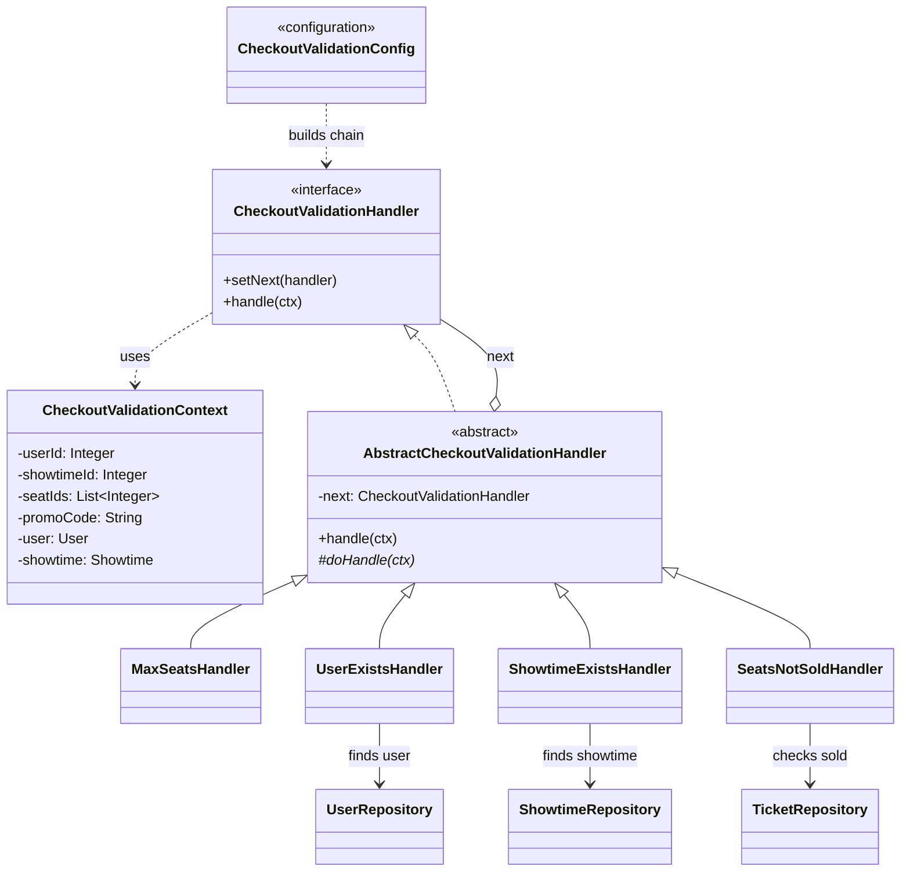

# Plan chi tiet — Chain of Responsibility (Checkout validation)

**Tham chieu quy uoc:** [00-patterns-conventions.md](00-patterns-conventions.md) · **UML goc domain:** [classdiagram.md](../classdiagram.md)

**Muc tieu:** Tach validation trong `CheckoutServiceImpl.createBooking()` thanh chuoi handler doc lap, de mo rong rule moi ma khong sua mot method qua lon.

**File hien co:** `backend/src/main/java/com/cinema/booking/services/impl/CheckoutServiceImpl.java`

**Package moi de xuat:** `com.cinema.booking.patterns.chainofresponsibility`

---

## Buoc 0 — Chuan bi

1. Doc toan bo `createBooking()` va liet ke tung dieu kien hien co (user, showtime, ghe da ban, promo neu co).
2. Quyet dinh **context** dung chung cho chain: vi du `CheckoutValidationContext` chua `userId`, `showtimeId`, `seatIds`, `promoCode`, va cac field sau khi pass (User, Showtime, …) neu can tranh query lap.

---

## Buoc 1 — Dinh nghia interface handler

1. Tao `CheckoutValidationHandler` (abstract hoac interface) voi:
   - `void setNext(CheckoutValidationHandler next);`
   - `void handle(CheckoutValidationContext ctx);` hoac tra `Optional<String>` / nem `RuntimeException` thong nhat voi codebase.
2. Thong nhat **cach bao loi**: giu message tieng Viet nhu hien tai (`RuntimeException`).

---

## Buoc 2 — Implement tung handler (map 1-1 voi logic cu)

Thu tu de xuat (co the doi de fail-fast):

| Handler | Trach nhiem | Ghi chu |
|---------|-------------|---------|
| `MaxSeatsHandler` | `seatIds == null` hoac rong → loi; `seatIds.size() > 8` → loi ro rang | **Bat buoc** theo yeu cau nghiep vu |
| `UserExistsHandler` | `userRepository.findById(userId)` | Giu message: "Nguoi dung khong ton tai" |
| `ShowtimeExistsHandler` | `showtimeRepository.findById(showtimeId)` | Giu message: "Suat chieu khong ton tai" |
| `SeatsNotSoldHandler` | Vong lap `ticketRepository.existsByBooking_Showtime_ShowtimeIdAndSeat_SeatId` | Giu message ghe da ban |
| `PromoOptionalHandler` (neu can) | Chi validate khi co `promoCode` — chi them neu hien tai dang validate o day; neu promo chi dung khi tinh gia, co the bo qua chain | Tranh trung logic voi `BookingServiceImpl.calculatePrice` |

Sau moi handler: neu OK thi goi `next.handle(ctx)`.

---

## Buoc 3 — Factory / builder chuoi

1. Tao `CheckoutValidationChainFactory` hoac method static `buildDefaultChain(...dependencies)` inject repository can thiet.
2. Noi chuoi: `h1.setNext(h2); ... setNext(hLast);`
3. **Khong** de `CheckoutServiceImpl` tu `new` tung handler neu dung Spring: danh dau handler la `@Component` hoac tao `@Bean` chain trong `config`.

---

## Buoc 4 — Refactor `CheckoutServiceImpl.createBooking()`

1. Xoa/trim cac block validation cu.
2. Dau method: tao `context`; `validationChain.handle(context);`
3. Phan con lai (tinh gia, luu booking, F&B, MoMo) giu nguyen thu tu nghiep vu.

---

## Buoc 5 — Kiem thu

1. **Happy path:** 1–8 ghe, user/showtime hop le.
2. **Max seats:** gui 9 ghe → loi ro rang.
3. **Ghe da ban:** giu hanh vi cu.
4. Regression: response API `/api/payment/checkout` khong doi contract.

---

## Rui ro & luu y

- Tranh query DB trung: co the cache `User`/`Showtime` tren `context` sau handler dau tien.
- Neu them rule "showtime da chieu xong", them handler moi **khong sua** handler cu.

---

## Cau truc lop va thu muc (bat buoc)

| Lop / artifact | Vai tro | Ghi chu |
|----------------|---------|---------|
| `CheckoutValidationContext` | DTO / context chuyen qua chain | Chua `userId`, `showtimeId`, `seatIds`, `promoCode`; co the them `User`, `Showtime` sau handler dau de tranh query lap |
| `CheckoutValidationHandler` | **Interface** | `setNext`, `handle` |
| `AbstractCheckoutValidationHandler` | **Abstract** (khuyen nghi) | Code lap: luu `next`, template goi `doValidate` roi `next.handle` |
| `MaxSeatsHandler`, `UserExistsHandler`, `ShowtimeExistsHandler`, `SeatsNotSoldHandler` | **Concrete** | Moi class mot dieu kien; `MaxSeatsHandler` bat buoc `MAX_SEATS_PER_BOOKING = 8` |
| `CheckoutValidationChainFactory` hoac `@Configuration` | Lap rap chuoi | Khong chua business logic nghiep vu |

**Duong dan:** `backend/src/main/java/com/cinema/booking/patterns/chainofresponsibility/`

**Mapping domain:** Luong sau validation tao [Booking](../classdiagram.md) (xem lop `Booking` trong `classdiagram.md`). Ten lop Spring `CheckoutServiceImpl` co the ghi chu trong UML duoi day neu can.

---

## Clean Code va SOLID

- **S:** Moi handler chi mot rule validation.
- **O:** Them handler moi, khong sua handler cu (OCP).
- **L:** Handler con thay the duoc trong chuoi neu giu contract `handle`.
- **I:** Interface handler hep (chi chain).
- **D:** `CheckoutServiceImpl` phu thuoc `CheckoutValidationHandler` (dau chuoi) / factory, khong `new` tung concrete trong method dai.

**Clean Code:** Hang so `MAX_SEATS_PER_BOOKING`; message loi thong nhat; factory chi noi day chuyen.

---

## UML — Chain of Responsibility (Mermaid)

> Tham chieu domain: [classdiagram.md](../classdiagram.md). **UML pattern rieng** — khong gop vao `classdiagram.md` goc; sua sai chi can file plan nay.

---

## Checklist hoan thanh

- [x] `MaxSeatsHandler` enforce tối đa 8 ghế
- [x] Toàn bộ validation cũ đã chuyển vào chain
- [x] `createBooking()` gọn, chỉ điều phối
- [x] Build/test backend pass
