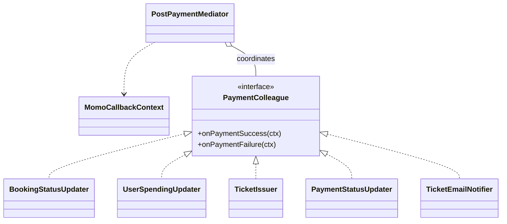

# Plan chi tiet — Mediator (Hau thanh toan / MoMo callback)

**Tham chieu quy uoc:** [00-patterns-conventions.md](00-patterns-conventions.md) · **UML goc domain:** [classdiagram.md](../classdiagram.md)

**Muc tieu:** Tach `CheckoutServiceImpl.processMomoCallback()` thanh cac buoc doc lap, dieu phoi qua mot Mediator, giam "God method".

**File hien co:** `backend/src/main/java/com/cinema/booking/services/impl/CheckoutServiceImpl.java`

**Package moi de xuat:** `com.cinema.booking.patterns.mediator`

---

## Buoc 0 — Phan tich luong hien tai

1. Liet ke tung khoi trong `processMomoCallback`:
   - Verify chu ky MoMo
   - Parse `extraData` → `bookingId`, `seatIds`
   - Nhanh **thanh cong**: cap nhat Booking PAID, user spending, tao Ticket, cap nhat Payment SUCCESS, gui email
   - Nhanh **that bai**: Payment FAILED, Booking CANCELLED
2. Xac dinh **transaction boundary**: giu `@Transactional` o dau (thuong mot method service ngoai cung).

---

## Buoc 1 — Dinh nghia DTO / context noi bo

1. Tao `MomoCallbackContext` chua:
   - `MomoCallbackRequest callback`
   - `Booking booking` (sau khi load)
   - `List<Integer> seatIds` (parse xong)
   - `boolean success` (hoac suy ra tu resultCode / devAllSuccess)

---

## Buoc 2 — Interface Colleague

1. Tao `PaymentColleague` (interface) voi method kieu:
   - `void onPaymentSuccess(MomoCallbackContext ctx);`
   - `void onPaymentFailure(MomoCallbackContext ctx);`
   hoac tach interface nho hon neu colleague chi xu ly mot nhanh.
2. Implement tung colleague **mong**, chi lam mot viec:
   - `BookingStatusUpdater` — set PAID / CANCELLED
   - `UserSpendingUpdater` — cong `totalSpending`
   - `TicketIssuer` — tao `Ticket` theo seatIds (giu logic tinh `ticketPrice` nhu cu)
   - `PaymentStatusUpdater` — PENDING → SUCCESS / FAILED
   - `TicketEmailNotifier` — goi `emailService.sendTicketEmail`

---

## Buoc 3 — Mediator

1. Tao `PostPaymentMediator` voi danh sach colleague (constructor injection).
2. Method `settleSuccess(ctx)`:
   - Goi lan luot: vi du cap nhat booking → tickets → payment → email (email co the try/catch khong rollback booking neu giu hanh vi cu).
3. Method `settleFailure(ctx)`:
   - Cap nhat payment failed + booking cancelled nhu code hien tai.
4. **Khong** de colleague goi nhau truc tiep; moi thu qua Mediator hoac qua context doc.

---

## Buoc 4 — Tich hop Spring

1. `@Service` cho `PostPaymentMediator` va cac colleague (hoac `@Component`).
2. Trong `CheckoutServiceImpl`, inject `PostPaymentMediator`.
3. `processMomoCallback` chi con: verify + parse → load booking → `if (success) mediator.settleSuccess(ctx); else mediator.settleFailure(ctx);`

---

## Buoc 5 — Giu nguyen hanh vi nghiep vu

1. Giu flag `devAllSuccess` nhu hien tai.
2. Giu decode `%7C` cho `extraData` neu dang dung.
3. Giu try/catch quanh email/payment update neu **co** khong rollback booking PAID (ghi chu ro trong code).

---

## Buoc 6 — Kiem thu

1. Callback thanh cong: booking PAID, co ticket, payment SUCCESS, email duoc goi.
2. Callback that bai: payment FAILED, booking CANCELLED.
3. Chu ky khong hop le: giu throw nhu cu.

---

## Cau truc lop va thu muc (bat buoc)

| Lop / artifact | Vai tro |
|----------------|---------|
| `MomoCallbackContext` | DTO noi bo: callback, `Booking`, `seatIds`, success flag |
| `PaymentColleague` | **Interface** — `onPaymentSuccess` / `onPaymentFailure` (hoac tach interface hep) |
| `PostPaymentMediator` | **Service** — dieu phoi thu tu, khong chua chi tiet SQL |
| `BookingStatusUpdater`, `UserSpendingUpdater`, `TicketIssuer`, `PaymentStatusUpdater`, `TicketEmailNotifier` | **Concrete colleague** — moi class mot buoc |

**Duong dan:** `backend/src/main/java/com/cinema/booking/patterns/mediator/`

**Mapping domain:** Thong nhat voi luong [Booking](../classdiagram.md), [Payment](../classdiagram.md), [Ticket](../classdiagram.md) trong `classdiagram.md`.

---

## Clean Code va SOLID

- **S:** Mediator chi orchestrate; moi colleague mot viec.
- **O:** Them colleague moi khi co buoc hau toan moi.
- **L:** Colleague implement dung contract interface.
- **I:** Interface colleague hep.
- **D:** Mediator phu thuoc `PaymentColleague`, khong phu thuoc truc tiep tang repository o nhieu noi trong mot method dai.

**Clean Code:** Tach `settleSuccess` thanh private methods (`updateBookingPaid`, `issueTickets`, …) neu qua dai.

---

## UML — Mediator (Mermaid)

> Tham chieu domain: [classdiagram.md](../classdiagram.md). **UML pattern rieng** — khong gop vao `classdiagram.md` goc; sua sai chi can file plan nay.

---

## Checklist hoan thanh

- [x] `processMomoCallback` ngắn, không còn khối logic lớn
- [x] Mỗi colleague một trách nhiệm
- [x] Không đổi API `PaymentController`
- [x] Build/test pass
