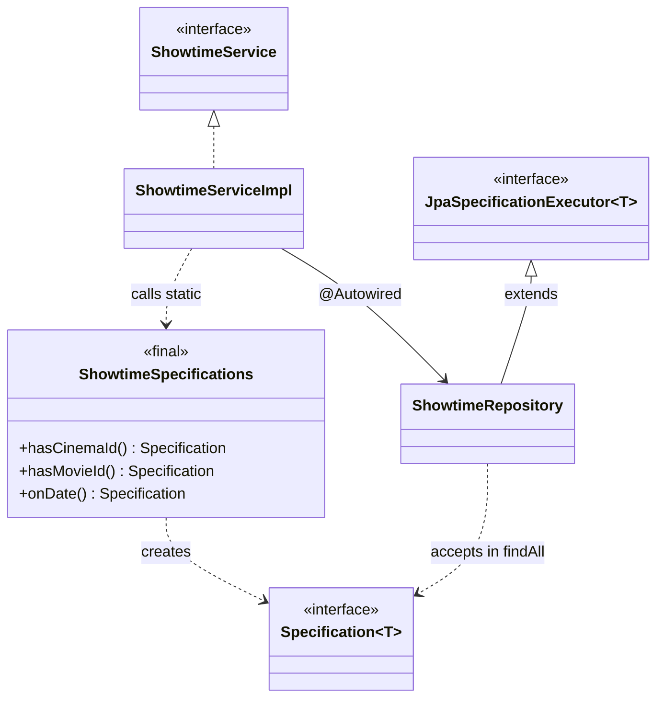

# Plan chi tiet — Specification (Loc showtime cong khai)

**Tham chieu quy uoc:** [00-patterns-conventions.md](00-patterns-conventions.md) · **UML goc domain:** [classdiagram.md](../classdiagram.md)

**Muc tieu:** Thay `PublicController.getPublicShowtimes()` load full roi `stream().filter()` bang truy van DB co dieu kien (`Specification`).

**File hien co:** `PublicController.java`, `ShowtimeRepository.java`, `ShowtimeService` / `ShowtimeServiceImpl`.

**Package moi de xuat:** `com.cinema.booking.patterns.specification`

---

## Buoc 0 — Mo rong repository

1. Sua `ShowtimeRepository`:

```java
public interface ShowtimeRepository extends JpaRepository<Showtime, Integer>, JpaSpecificationExecutor<Showtime> {
    // giu nguyen cac method cu (findByRoom_RoomIdAndStartTimeBetween, ...)
}
```

2. Build de chac import `org.springframework.data.jpa.domain.Specification` dung.

---

## Buoc 1 — Thiet ke predicate

1. Tao class `ShowtimeSpecification` voi static factory methods, vi du:
   - `hasCinemaId(Integer cinemaId)` — join `room` → `cinema` (`Showtime.room.cinema.cinemaId`).
   - `hasMovieId(Integer movieId)`
   - `onDate(LocalDate date)` — `startTime` trong khoang ngay do (ghi ro timezone / `LocalDateTime`).

2. Ket hop: `Specification.where(base).and(...).and(...)`.

---

## Buoc 2 — Tranh N+1 khi map DTO

1. Hien `ShowtimeServiceImpl.mapToDTO` doc `movie`, `room`, `cinema` — khi query Specification can `JOIN FETCH` hoac `@EntityGraph`.
2. Trong Criteria, co the dung fetch join **mot lan** (chu y duplicate row — `distinct(true)` neu can).

---

## Buoc 3 — Tich hop service layer (khuyen nghi)

1. Them method vao `ShowtimeService`:
   - `List<ShowtimeDTO> searchPublicShowtimes(Integer cinemaId, Integer movieId, LocalDate date);`
2. `ShowtimeServiceImpl` goi `showtimeRepository.findAll(spec)` roi `mapToDTO` nhu cu.
3. `PublicController` goi service, **khong** tu build Specification (giu controller mong).

---

## Buoc 4 — Refactor `PublicController`

1. Xoa doan `getAllShowtimes()` + nhieu `stream().filter`.
2. Parse `date` string → `LocalDate` trong try/catch; invalid date → 400 hoac empty list (thong nhat voi API hien tai).

---

## Buoc 5 — Kiem thu

1. Khong tham so: tra ve tat ca (hoac gioi han pagination neu sau nay them).
2. `cinemaId`, `movieId`, `date` tung cap va ket hop.
3. So sanh ket qua voi ban cu tren dataset nho.

---

## Rui ro

- Join fetch lam thay doi so dong — dung `distinct(true)` trong `CriteriaQuery` neu can.
- Mui gio: `LocalDate.parse` + `atStartOfDay` phai nhat quan voi DB.

---

## Cau truc lop va thu muc (bat buoc)

| Lop / artifact | Vai tro |
|----------------|---------|
| `ShowtimeRepository` | **Sua** — `extends JpaRepository<Showtime,Integer>, JpaSpecificationExecutor<Showtime>` |
| `ShowtimeSpecifications` | **Final class**, private constructor — static factories tra `Specification<Showtime>` |
| `ShowtimeService` / `ShowtimeServiceImpl` | Goi `findAll(Spec)` + `mapToDTO`; `PublicController` mong |

**Duong dan:** `backend/src/main/java/com/cinema/booking/patterns/specification/ShowtimeSpecifications.java`

**Mapping domain:** [Showtime](../classdiagram.md), [Room](../classdiagram.md), [Movie](../classdiagram.md) trong `classdiagram.md`.

---

## Clean Code va SOLID

- **S:** Predicate dat ten ro (`hasCinemaId`, `onDate`); controller khong chua logic loc.
- **O:** Them static factory moi cho dieu kien loc moi.
- **D:** Service phu thuoc `Specification` / repository abstraction.

**Clean Code:** `ShowtimeSpecifications` final + private ctor; tranh magic string trong predicate — dung hang so hoac enum.

---

## UML — Specification (Mermaid)

> Tham chieu domain: [classdiagram.md](../classdiagram.md). **UML pattern rieng** — khong gop vao `classdiagram.md` goc; sua sai chi can file plan nay.



---

## Checklist hoan thanh

- [x] `ShowtimeRepository extends JpaSpecificationExecutor<Showtime>`
- [x] `ShowtimeSpecifications` cover cinema / movie / date
- [x] `PublicController` không còn filter in-memory full table
- [x] Build/test pass
