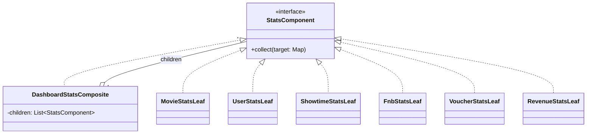

# Plan chi tiet — Composite (Dashboard thong ke)

**Tham chieu quy uoc:** [00-patterns-conventions.md](00-patterns-conventions.md) · **UML goc domain:** [classdiagram.md](../classdiagram.md)

**Muc tieu:** Gom logic thong ke trong `DashboardController` thanh cay component (Composite), controller chi goi mot lan `collect()`.

**File hien co:** `DashboardController.java`

**Package moi de xuat:** `com.cinema.booking.patterns.composite`

---

## Buoc 0 — Liet ke metric hien tai

Tu `getStats()` va `getWeeklyRevenue()`:

1. `totalMovies` — `movieRepository.count()`
2. `totalUsers` — `userRepository.count()`
3. `totalShowtimes` — `showtimeRepository.count()`
4. `totalFnbItems` — `fnbItemRepository.count()`
5. `totalVouchers` — `voucherService.getAllVouchers().size()` (try/catch → 0)
6. `totalRevenue`, `totalTickets` — tu `Payment` SUCCESS (logic hien tai)

Weekly revenue: co the de **mot leaf rieng** hoac method rieng tren service dashboard de khong ep mot Composite cho moi endpoint.

---

## Buoc 1 — Interface `StatsComponent`

1. Method de xuat:
   - `void collect(Map<String, Object> target);`
2. Composite `DashboardStatsComposite` implements `StatsComponent`, giu `List<StatsComponent> children`.
3. `collect`: voi moi child goi `child.collect(map)`.

---

## Buoc 2 — Leaf classes

Tao tung leaf inject repository/service tuong ung:

| Leaf | Key ghi vao map |
|------|-----------------|
| `MovieStatsLeaf` | `totalMovies` |
| `UserStatsLeaf` | `totalUsers` |
| `ShowtimeStatsLeaf` | `totalShowtimes` |
| `FnbStatsLeaf` | `totalFnbItems` |
| `VoucherStatsLeaf` | `totalVouchers` |
| `RevenueStatsLeaf` | `totalRevenue`, `totalTickets` |

**RevenueStatsLeaf:** giu logic filter `Payment.PaymentStatus.SUCCESS` nhu controller hien tai.

---

## Buoc 3 — Spring wiring

1. `@Component` cho moi leaf + composite, hoac mot `@Configuration` tao `@Bean DashboardStatsComposite` add children theo thu tu.
2. `DashboardController` inject `DashboardStatsComposite` (va giu nguyen endpoint weekly hoac tach component sau).

---

## Buoc 4 — Refactor `getStats()`

1. `Map<String, Object> stats = new HashMap<>();`
2. `dashboardStatsComposite.collect(stats);`
3. `return ResponseEntity.ok(stats);`

---

## Buoc 5 — Weekly endpoint (tuy chon v1)

1. Giu `getWeeklyRevenue()` trong controller neu chua muon Composite hoa.
2. Hoac tao `WeeklyRevenueLeaf` nhan `PaymentRepository` va ghi list vao key `weeklyRevenue`.

---

## Buoc 6 — Kiem thu

1. So sanh JSON `/api/admin/dashboard/stats` truoc va sau (cung DB).
2. Dam bao `totalVouchers` van fallback 0 khi Redis loi.

---

## Cau truc lop va thu muc (bat buoc)

| Lop / artifact | Vai tro |
|----------------|---------|
| `StatsComponent` | **Interface** — `collect(Map target)` |
| `DashboardStatsComposite` | **Composite** — giu `List<StatsComponent>`, goi `collect` tung child |
| `MovieStatsLeaf`, `UserStatsLeaf`, `ShowtimeStatsLeaf`, `FnbStatsLeaf`, `VoucherStatsLeaf`, `RevenueStatsLeaf` | **Leaf** — moi leaf mot nguon du lieu |
| `AbstractStatsLeaf` | **Tuy chon** — neu cac leaf chia se code lap |

**Duong dan:** `backend/src/main/java/com/cinema/booking/patterns/composite/`

**Mapping domain:** Thong ke lien quan [Movie](../classdiagram.md), [Payment](../classdiagram.md), [Admin](../classdiagram.md) (`viewDashboard`) trong `classdiagram.md`.

---

## Clean Code va SOLID

- **S:** Moi leaf mot metric / mot nguon; composite khong viet SQL truc tiep.
- **O:** Them leaf moi khi co metric moi.
- **L:** Leaf thay the duoc neu giu `StatsComponent`.
- **I:** Interface `StatsComponent` hep.
- **D:** Controller phu thuoc `DashboardStatsComposite` (hoac `StatsComponent`), khong 5 repository.

**Clean Code:** Key trong map thong nhat hang so hoac enum.

---

## UML — Composite (Mermaid)

> Tham chieu domain: [classdiagram.md](../classdiagram.md). **UML pattern rieng** — khong gop vao `classdiagram.md` goc; sua sai chi can file plan nay.

---

## Checklist hoan thanh

- [x] Composite + 6 leaf (Movie, User, Showtime, Fnb, Voucher, Revenue)
- [x] Controller gọn, không inject 5 repo trực tiếp cho `getStats`
- [x] Build/test pass
