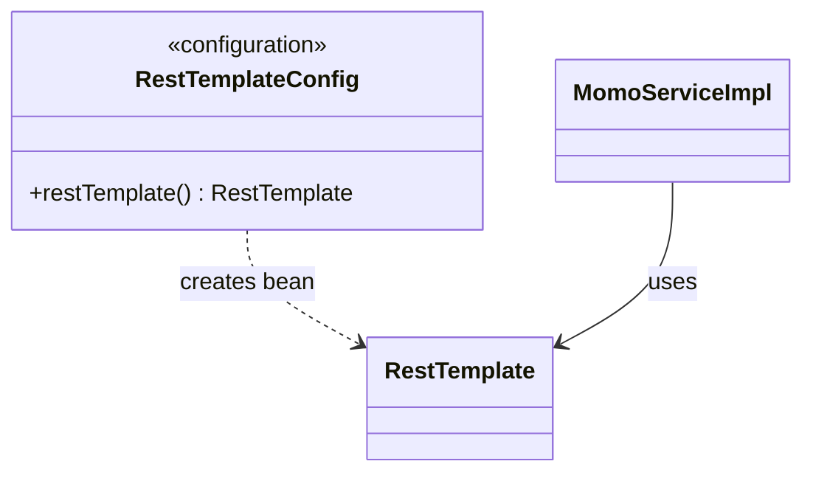

# Plan chi tiet — Singleton (RestTemplate bean cho MoMo)

**Tham chieu quy uoc:** [00-patterns-conventions.md](00-patterns-conventions.md) · **UML goc domain:** [classdiagram.md](../classdiagram.md)

**Muc tieu:** Khong tao `new RestTemplate()` trong `MomoServiceImpl`; dung bean do Spring quan ly (singleton scope mac dinh), de test va cau hinh.

**File hien co:** `MomoServiceImpl.java`, `config/*`

---

## Buoc 0 — Xac nhan cach dung RestTemplate

1. Mo `MomoServiceImpl` — tim field `RestTemplate`.
2. Grep toan project `new RestTemplate()` — dam bao khong cho nao khac tao thu cong.

---

## Buoc 1 — Tao `RestTemplateConfig`

1. Tao file `backend/src/main/java/com/cinema/booking/config/RestTemplateConfig.java`.
2. Noi dung toi thieu:
   - `@Configuration`
   - `@Bean` method tra ve `RestTemplate`
3. (Tuy chon) Cau hinh timeout (connect/read), `BufferingClientHttpRequestFactory` neu can log body — v1 co the giu default.

---

## Buoc 2 — Inject vao `MomoServiceImpl`

1. Xoa `private final RestTemplate restTemplate = new RestTemplate();`
2. Constructor injection:

```java
private final RestTemplate restTemplate;

public MomoServiceImpl(RestTemplate restTemplate) {
    this.restTemplate = restTemplate;
}
```

3. Giu nguyen `createPayment` / `verifySignature`.

---

## Buoc 3 — Kiem tra context

1. Chay ung dung — dam bao khong loi `No qualifying bean`.
2. Neu sau nay co nhieu `RestTemplate` beans — dat `@Qualifier("momoRestTemplate")` cho ro.

---

## Buoc 4 — Test (tuy chon)

1. Unit test `MomoServiceImpl` voi `MockRestServiceServer` hoac mock `RestTemplate`.

---

## Cau truc lop va thu muc (bat buoc)

| Lop / artifact | Vai tro |
|----------------|---------|
| `RestTemplateConfig` | `@Configuration` — `@Bean` tao **mot** `RestTemplate` (singleton scope Spring) |
| `RestTemplate` | Bean HTTP client — inject vao `MomoServiceImpl` |
| `MomoServiceImpl` | **Sua** — constructor inject `RestTemplate`, khong `new RestTemplate()` |

**Duong dan:** `backend/src/main/java/com/cinema/booking/config/RestTemplateConfig.java`

**Khong** tao package `patterns/singleton`. Day la **Singleton do IoC**, khong static holder thu cong.

**Mapping domain:** [Payment](../classdiagram.md) — `processPayment` trong `classdiagram.md` tuong ung luong thanh toan; MoMo la integration thuc te.

---

## Clean Code va SOLID

- **S:** Config class chi tao bean client.
- **D:** `MomoServiceImpl` phu thuoc `RestTemplate` abstraction, khong tao truc tiep.

**Clean Code:** Neu nhieu bean HTTP sau nay — `@Qualifier("momoRestTemplate")`.

---

## UML — Singleton qua Spring IoC (Mermaid)

> Tham chieu domain: [classdiagram.md](../classdiagram.md). **UML pattern rieng** — khong gop vao `classdiagram.md` goc; sua sai chi can file plan nay.



---

## Checklist hoan thanh

- [x] `RestTemplateConfig.java` tồn tại với `@Bean RestTemplate`
- [x] `MomoServiceImpl` không `new RestTemplate()` — dùng constructor injection
- [x] Ứng dụng chạy OK
- [x] (Tùy chọn) Test gọi MoMo dev
