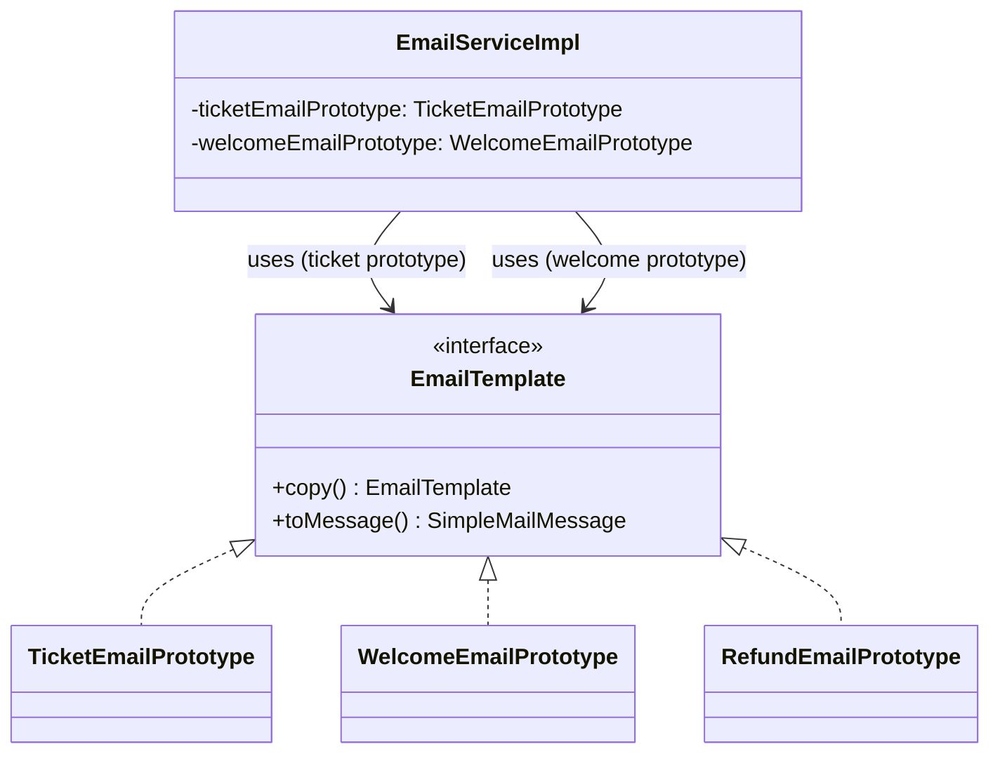

# Plan chi tiet — Prototype (Email template)

**Tham chieu quy uoc:** [00-patterns-conventions.md](00-patterns-conventions.md) · **UML goc domain:** [classdiagram.md](../classdiagram.md)

**Muc tieu:** Tranh lap cau truc `SimpleMailMessage` + chuoi noi trong `EmailServiceImpl`; moi loai email la mot prototype co the copy/customize.

**File hien co:** `EmailServiceImpl.java`, `EmailService.java`

**Package moi de xuat:** `com.cinema.booking.patterns.prototype`

---

## Buoc 0 — Xac dinh cac loai email hien co

1. `sendTicketEmail(Integer bookingId)`
2. `sendWelcomeEmail(String email, String fullname)`
3. (Tuy chon) `RefundEmailTemplate` — neu chua co API, tao class san cho mo rong.

---

## Buoc 1 — Thiet ke `EmailTemplate`

1. Abstract class hoac interface voi:
   - `EmailTemplate copy();` — shallow copy cac field prototype (subject template, body template).
   - `SimpleMailMessage toMessage(...);` hoac tra DTO `{to, subject, text}`.
2. Prototype pattern: registry giu **instance mau** (singleton trong Spring) — vi du `@Component` prototype voi `copy()` tra instance moi.

---

## Buoc 2 — Implement cu the

1. `TicketEmailTemplate`:
   - Nhan data sau khi load `Booking` (hoac nhan bookingId va de service load).
   - Giu noi dung tieng Viet nhu hien tai.
2. `WelcomeEmailTemplate`:
   - Nhan `email`, `fullname`.

---

## Buoc 3 — Refactor `EmailServiceImpl`

1. Inject prototype beans hoac `EmailTemplateRegistry`.
2. `sendTicketEmail`: load booking → `ticketPrototype.copy()` → dien du lieu → `mailSender.send`.
3. `sendWelcomeEmail` tuong tu.

---

## Buoc 4 — Xu ly loi

1. Giu try/catch log nhu hien tai hoac nem exception tuy chuan du an.
2. **Khong** doi public API `EmailService`.

---

## Buoc 5 — Kiem thu

1. Dang ky user moi — welcome email (neu SMTP bat).
2. Checkout thanh cong — ticket email.
3. Kiem tra khong null pointer khi booking null.

---

## Rui ro

- Tranh nham `clone()` cua `Object` / `Cloneable` — dat ten `copy()` ro rang.
- Neu sau nay chuyen HTML email, template co the tra `MimeMessageHelper`.

---

## Cau truc lop va thu muc (bat buoc)

| Lop / artifact | Vai tro |
|----------------|---------|
| `EmailTemplate` | **Interface** — `copy()`, `toMessage(...)` hoac build DTO |
| `AbstractEmailTemplate` | **Tuy chon** — code lap giua prototype |
| `TicketEmailPrototype`, `WelcomeEmailPrototype`, `RefundEmailPrototype` | **Concrete** — `@Component`, `copy()` tra instance moi |
| `EmailServiceImpl` | **Sua** — dung prototype, khong noi chuoi dai trong method |

**Duong dan:** `backend/src/main/java/com/cinema/booking/patterns/prototype/`

**Mapping domain:** [Notification](../classdiagram.md) trong `classdiagram.md` (thong bao); email la kenh giao tiep bo sung, co the ghi chu lien ket trong UML tong.

---

## Clean Code va SOLID

- **S:** Moi prototype mot loai email; `EmailServiceImpl` chi dieu phoi gui.
- **O:** Them loai email = them class prototype moi.
- **I:** Interface `EmailTemplate` hep.
- **D:** `EmailServiceImpl` phu thuoc `EmailTemplate` (hoac registry interface).

**Clean Code:** Noi dung mail nam trong template, khong trong service.

---

## UML — Prototype (Mermaid)

> Tham chieu domain: [classdiagram.md](../classdiagram.md). **UML pattern rieng** — khong gop vao `classdiagram.md` goc; sua sai chi can file plan nay.

---

## Checklist hoan thanh

- [x] `EmailTemplate` + 3 implementation (TicketEmailPrototype, WelcomeEmailPrototype, RefundEmailPrototype)
- [x] `EmailServiceImpl` gọn, không lặp cấu trúc message — dùng `copy() → populate → toMessage()`
- [x] Build/test pass
